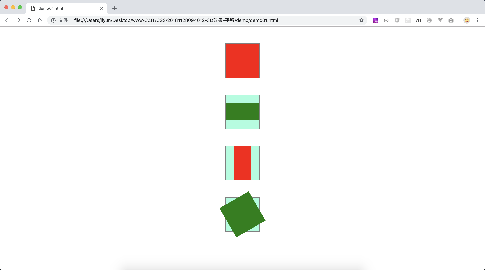
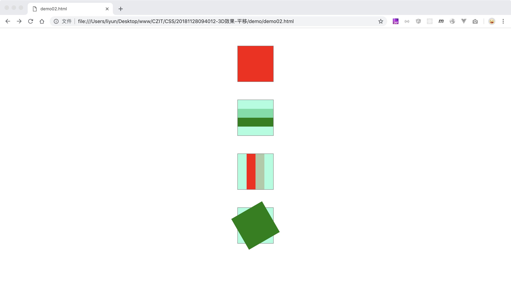
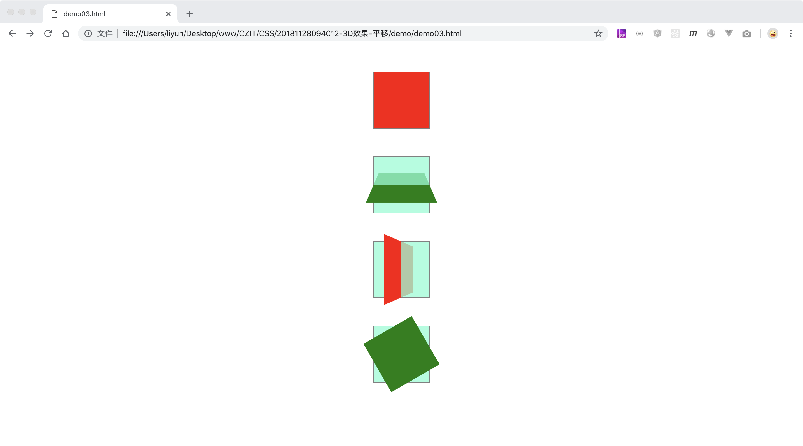

# CSS 中的 3D 转换

3D 转换的前提是位元素设定视觉点和

## 3D 旋转

格式： rotate3d(X 轴角度，Y 轴角度，Z 轴角度)

或者可以分别设置三个方向的旋转角度

-   rotateX(X 轴角度)
-   rotateY(Z 轴角度)
-   rotateZ(Z 轴角度)

```html
<style>
    .outer {
        width: 100px;
        height: 100px;
        margin: 50px auto;
        border: 1px solid gray;
        background-color: rgba(127, 255, 212, 0.753);
    }
    .inner {
        width: 100%;
        height: 100px;
    }
    .outer:nth-child(odd) .inner {
        background-color: red;
    }
    .outer:nth-child(even) .inner {
        background-color: green;
    }
    .outer:nth-child(2) .inner {
        transform: rotateX(60deg);
    }
    .outer:nth-child(3) .inner {
        transform: rotateY(60deg);
    }
    .outer:nth-child(4) .inner {
        transform: rotateZ(60deg);
    }
</style>
<div class="outer"><div class="inner"></div></div>
<div class="outer"><div class="inner"></div></div>
<div class="outer"><div class="inner"></div></div>
<div class="outer"><div class="inner"></div></div>
```

[案例源码](./demo/demo01.html)



从效果中可以看出，这时的 3D 效果并不是我们想要的，其中`rotateX()`只是改变了元素的宽度，`rotateY()`只是改变了元素的高度，`rotateZ()`则看起来和 2D 变换中的`rotate()`效果相似。

这是因为此时我们的元素处于一个二维平面上，二维平面上只有横轴和纵轴，是没有“深度”的。要想让“深度”出现，只需要给元素的父级添加一个属性`transform-style: 显示方式`，即可改变子元素所在的空间类型。

-   `flat`，默认值，表示的是二维空间
-   `perserve-3d`，让子元素处于一个三维空间之内

再来观看效果：

```html
<style>
    .outer {
        width: 100px;
        height: 100px;
        margin: 50px auto;
        border: 1px solid gray;
        background-color: rgba(127, 255, 212, 0.753);
        transform-style: preserve-3d;
    }
    .inner {
        width: 100%;
        height: 100px;
    }
    .outer:nth-child(odd) .inner {
        background-color: red;
    }
    .outer:nth-child(even) .inner {
        background-color: green;
    }
    .outer:nth-child(2) .inner {
        transform: rotateX(60deg);
    }
    .outer:nth-child(3) .inner {
        transform: rotateY(60deg);
    }
    .outer:nth-child(4) .inner {
        transform: rotateZ(60deg);
    }
</style>
<div class="outer"><div class="inner"></div></div>
<div class="outer"><div class="inner"></div></div>
<div class="outer"><div class="inner"></div></div>
<div class="outer"><div class="inner"></div></div>
```

[案例源码](./demo/demo02.html)



可以看到：使用了`rotateX()`和`rotateY()`的元素有一半已经被`父级元素`遮挡住了,`rotateZ()`也和第一个没什么不同，并没有真实世界中所看到的“近大远小”效果，这是因为现在我们查看元素的眼睛和元素的中心点在同一处位置，也就是说我们需要把观察元素的眼睛往身后“挪一下”，或者说是给观察者的眼睛设置一个位置(视角)；

再给`父级元素`添加一个属性`perspective: 200px`;这个属性的目的是以 body 元素作为平面，把观察者的眼睛放在距离`父级元素`平面 200px 的位置，再来看一下效果：

```html
<style>
    .outer {
        width: 100px;
        height: 100px;
        margin: 50px auto;
        border: 1px solid gray;
        background-color: rgba(127, 255, 212, 0.753);
        perspective: 200px;
        transform-style: preserve-3d;
    }
    .inner {
        width: 100%;
        height: 100px;
    }
    .outer:nth-child(odd) .inner {
        background-color: red;
    }
    .outer:nth-child(even) .inner {
        background-color: green;
    }
    .outer:nth-child(2) .inner {
        transform: rotateX(60deg);
    }
    .outer:nth-child(3) .inner {
        transform: rotateY(60deg);
    }
    .outer:nth-child(4) .inner {
        transform: rotateZ(60deg);
    }
</style>
<div class="outer"><div class="inner"></div></div>
<div class="outer"><div class="inner"></div></div>
<div class="outer"><div class="inner"></div></div>
<div class="outer"><div class="inner"></div></div>
```

[案例源码](./demo/demo03.html)



可以看出来“近大远小”的效果已经出来了。

下面是一个配合动画的案例：

```html
<style>
    .outer {
        width: 100px;
        height: 100px;
        margin: 50px auto;
        border: 1px solid gray;
        /* background-color: rgba(127, 255, 212, 0.753); */
        perspective: 200px;
        transform-style: preserve-3d;
    }
    .inner {
        width: 100%;
        height: 100px;
    }
    .outer:nth-child(odd) .inner {
        background-color: red;
    }
    .outer:nth-child(even) .inner {
        background-color: green;
    }
    .outer:nth-child(2) .inner {
        transform: rotateX(0deg);
        animation: rotate1 6s linear;
        animation-iteration-count: infinite;
    }
    @keyframes rotate1 {
        0% {
            transform: rotateX(0deg);
        }
        100% {
            transform: rotateX(360deg);
        }
    }
    .outer:nth-child(3) .inner {
        transform: rotateY(60deg);
        animation: rotate2 6s linear;
        animation-iteration-count: infinite;
    }
    @keyframes rotate2 {
        0% {
            transform: rotateY(0deg);
        }
        100% {
            transform: rotateY(360deg);
        }
    }
    .outer:nth-child(4) .inner {
        transform: rotateZ(60deg);
        animation: rotate3 6s linear;
        animation-iteration-count: infinite;
    }
    @keyframes rotate3 {
        0% {
            transform: rotateZ(0deg);
        }
        100% {
            transform: rotateZ(360deg);
        }
    }
</style>
<div class="outer"><div class="inner"></div></div>
<div class="outer"><div class="inner"></div></div>
<div class="outer"><div class="inner"></div></div>
<div class="outer"><div class="inner"></div></div>
```

[案例源码](./demo/demo03.html)


## 3D 平移

格式： translate3d(X 轴平移距离 Y 轴平移距离 Z 轴平移距离)

也可以分别设置三个方向的平移距离：

-   translateX(X 轴平移距离)
-   translateY(Z 轴平移距离)
-   translateZ(Z 轴平移距离)
