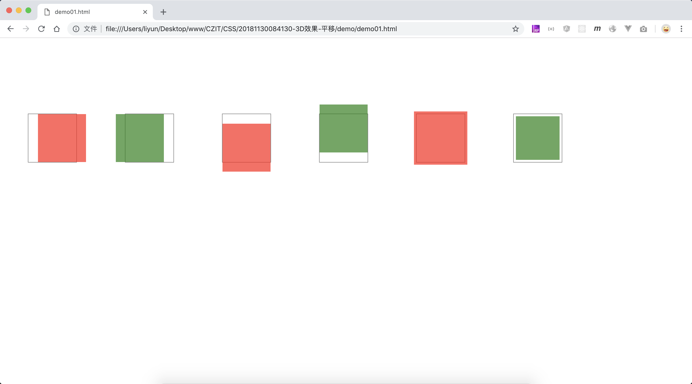

# 3D 效果中的平移

前面讲了 2D 效果的平移，这里讲一下 3D 效果中的平移，和前面的 3D 旋转一样，首先设置父元素的视角距离，再让子元素在一个三维空间中进行变化。

方法：`transform: translate3d(X轴平移距离，Y轴平移距离，Z轴平移距离)`

也可以使用下面的属性分开设置

-   `transform: translateX(X轴平移距离)`
-   `transform: translateY(Y轴平移距离)`
-   `transform: translateZ(Z轴平移距离)`

X 轴和 Y 轴的平移距离可以使用固定值，比如`20px`，也可以使用百分比值，百分比是根据`元素本身`的尺寸计算的。Z 轴的平移距离只能使用固定值，不能使用百分比，因为找不到对应的参照物。

```html
<style>
    .outer {
        width: 100px;
        height: 100px;
        float: left;
        margin: 150px 50px;
        border: 1px solid gray;
        perspective: 200px;
        transform-style: preserve-3d;
    }
    .inner {
        width: 100%;
        height: 100px;
        transform-origin: 50% 50%;
        animation: rotate 3s linear;
        animation-iteration-count: infinite;
    }
    .outer:nth-child(odd) .inner {
        background-color: rgba(255, 0, 0, 0.692);
    }
    .outer:nth-child(even) .inner {
        background-color: rgba(0, 128, 0, 0.692);
    }
    .outer:nth-child(1) .inner {
        transform: translateX(20%);
    }
    .outer:nth-child(2) .inner {
        transform: translateX(-20%);
    }
    .outer:nth-child(3) .inner {
        transform: translateY(20%);
    }
    .outer:nth-child(4) .inner {
        transform: translateY(-20%);
    }
    .outer:nth-child(5) .inner {
        transform: translateZ(20px);
    }
    .outer:nth-child(6) .inner {
        transform: translateZ(-20px);
    }
</style>
<div class="outer"><div class="inner"></div></div>
<div class="outer"><div class="inner"></div></div>
<div class="outer"><div class="inner"></div></div>
<div class="outer"><div class="inner"></div></div>
<div class="outer"><div class="inner"></div></div>
<div class="outer"><div class="inner"></div></div>
```

[案例源码](./demo/demo01.html)



从案例中可看出，`translateX()`和`translateY()`和 2D 中的效果没什么区别，`translateZ()`的参数为正数时，元素向视角的位置移动了一些，有一种“放大”了的效果。参数为负数时，元素距离视角的位置远离了一些，有一种“缩小”的感觉。

> 注意上面案例中 Z 轴平移是的参数，必须是固定值，不能使用百分比
