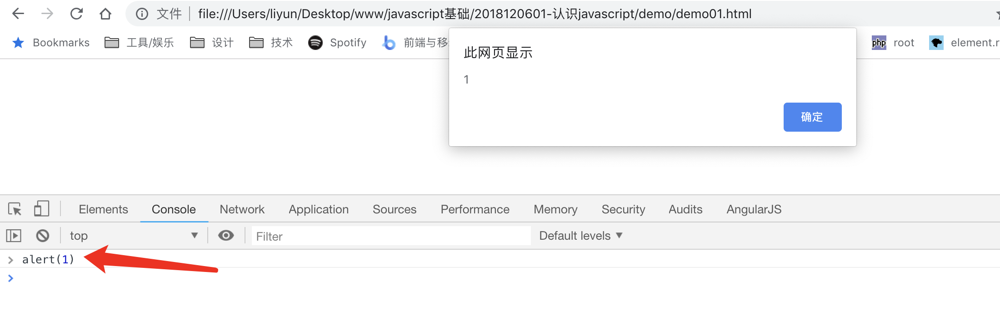
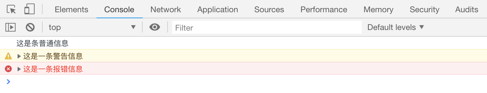

# 浏览器中的开发者工具

浏览器中都有一个开发者工具，可以把 JS 代码直接写在开发者工具的`控制台`中，去调试页面的功能



控制台中的语句在执行完毕后，会自动输出语句的返回值

## 打开开发者工具

通常情况下，浏览器都可以通过按下`F12`按键打开开发者工具

如果`F12`取消，可以通过在页面任何位置点击右键，选择**查看元素** 或者是**检查**等菜单可以打开开发者工具

## 在开发者工具中输出一些信息

通过一些 JS 语句，可以在开发者工具中的`控制台`输出一些信息，方便我们调试

```html
<script>
    console.log("这是条普通信息");
    console.warn("这是一条警告信息");
    console.warn("这是一条报错信息");
</script>
```

如果控制台的输出信息过多，可以通过`console.clear()`来清除所有的输出信息

