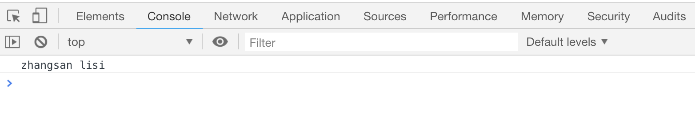

# JS 中的变量

变量是所有编程语言中必不可少的一部分。我们使用变量来保存一些信息。比如中学数学中的：

```
x=1 y=2 z=x+y z=?
```

变量名使用`var`关键字声明,使用`=`给变量赋值,等号后面是变量的具体内容

```js
var x = 1;
var y = 2;
```

变量名要注意的地方：

-   变量名必须以字母、`$`、`_`开头，但是我们不推荐后两种
-   变量名是区分大小写的，也就是说`xingming`和`xingMing`是两个不同的变量
-   变量名不能使用 JS 中的关键字，比如`var`, `if`,`else`,`switch`,`for`,`forEach`等等

```js
var xingming = "zhangsan";
var xingMing = "lisi";
console.log(xingming, xingMing);
```



> 变量也可以不使用`var`关键字声明而直接使用，但这不符合国际组织的规范，所以不推荐省略 `var`关键字

变量的值可以是任意一种数据类型，包括字符串、数字等，如果是字符串必须使用`单引号`或者`双引号`包括起来，如果给数字添加了`单引号`或者`双引号`，该变量就变成一个字符串变量了。

## 验证变量类型的方法

使用`typeof`可以简单的验证目标是什么数据类型

```js
console.log(typeof 1);
console.log(typeof "1");
```

[案例代码](./demo/demo01.html)


## 交换两个变量的值

如果两个变量`a`、`b`都各自有一个值，想要交换他们的值，需要第三个变量的配合

```js
var a = 1;
var b = 2;
var c;

c = 1;
a = b;
b = c;
```
