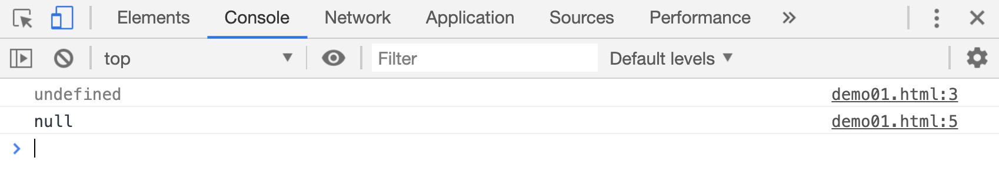

# JS 中的原始数据类型

JS 中的数据类型，分为原始数据类型和引用数据类型。其中原始数据类型一共有 6 中：

-   字符串(string)
-   数字(number)
-   布尔值(boolean)
-   未定义(undefined)
-   空值(null)
-   Symbol

> 原始数据类型不能修改它的值，只能重新赋值

## 字符串

JS 中的字符串必须使用`单引号`或者`双引号`包括起来，字符串的长度是没有限制的

```js
var name1 = "张三";
var name2 = "尼古拉斯-赵四";
```

字符串可以使用`+`拼接起来，返回一个新的字符串

```js
var s1 = "尼古拉斯" + "赵四";
console.log(s1); // '尼古拉斯赵四'
```

## 数值

JS 中的数字可以是整数，也可以是小数,由于一些原因，JS 中的数字必须在(-(2<sup>63</sup>-1))~(+(2<sup>63</sup>-1))之间。

```js
var age = 12;
var age2 = 12.2;
```

## 布尔值

布尔值只有两种类型，分别是`true`和`false`，对应着**正确的**和**错误的**两种状态。

## 未定义和空值

当变量被声明却没有赋值的时候，变量的值默认是`undefined`， 变量赋值之后，可以通过`null`清除变量已有的值。

```html
<script>
    var age;
    console.log(age); // undefined
    age = null;
    console.log(age); // null
</script>
```

[](./demo/demo01.html)


