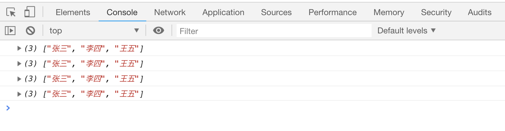
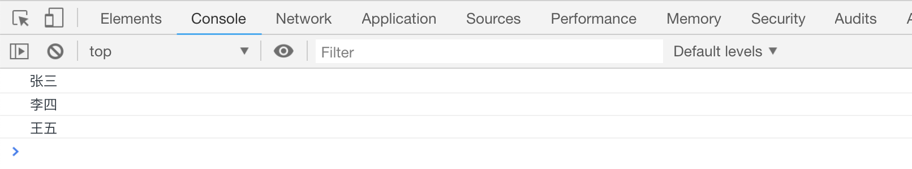

# JS 中的数据类型

JS 中一共有 6 种基础数据类型和 3 种引用数据类型。

基础数据类型： 字符串(string)、数字(number)、布尔值(boolean)、未定义(undefined)、空值(null)、Symbol

引用类型： 数组(array)、对象(object)、函数(function)

## 字符串

JS 中的字符串必须使用`单引号`或者`双引号`包括起来，字符串的长度是没有限制的

```js
var name1 = "张三";
var name2 = "尼古拉斯-赵四";
```

如果字符串中包含引号，可以在引号前面添加`\`符号

```js
var name = "江穗兵是个'小女人', 他才\"16岁\"";
```

## 数值

JS 中的数字可以是整数，也可以是小数,由于一些原因，JS 中的数字必须在(-(2<sup>63</sup>-1))~(+(2<sup>63</sup>-1))之间。

```js
var age = 12;
var age2 = 12.2;
```

## 布尔值

布尔值只有两种类型，分别是`true`和`false`，对应着**正确的**和**错误的**两种状态。

## 未定义和空值

当变量被声明却没有赋值的时候，变量的值默认是`undefined`， 变量赋值之后，可以通过`null`清除变量已有的值。

```js
var name;
console.log(name); // undefined
name = null;
console.log(name); // null
```

## 数组

数组可以用来存放多个数据，声明方式有以下几种,最终的结果是相同的

```js
// 第一种
var names1 = new Array();
names1[0] = "张三";
names1[1] = "李四";
names1[2] = "王五";

// 第二种
var names2 = new Array("张三", "李四", "王五");

// 第三种
var names3 = ["张三", "李四", "王五"];

// 第四种
var names4 = [];
names4[0] = "张三";
names4[1] = "李四";
names4[2] = "王五";
```

[案例代码](./demo/demo01.html)



数组中的每个数据可以通过下标来获取，下标从 0 开始

```js
var names = ["张三", "李四", "王五"];
console.log(names[0]); // '张三'
console.log(names[1]); // '李四'
console.log(names[2]); // '王五'
```

[案例代码](./demo/demo02.html)



## 对象

对象可以看做是同时保存了多个属性的盒子，所有的属性使用`{}`包括起来，且属性和属性值分别以`key:value`的形式保存。比如

```js
var person1 = {
    name: '张三'
    width: '80kg',
    height: '180cm',
}
```

也可以先赋值一个空对象，再往里面添加数据，添加方式有两种:

-   使用`.`运算符：

```js
var person1 = {};
person1.name = "张三";
person1.width = "80kg";
person1.height = "180cm";
console.log(person1);
```

-   使用`[]`运算符

```js
var person2 = {};
person2["name"] = "张三";
person2["width"] = "80kg";
person2["height"] = "180cm";
console.log(person2);
```

[案例代码](./demo/demo03.html)


以上两种方式声明的变量结果是相同的。同样的，如果想获取对象中某个属性的值，也有两种方式：

```js
var person1 = {
    name: "张三",
    width: "80kg",
    height: "180cm",
};
// 第一种方式：
console.log(person1.name); // '张三'
// 第二种方式：
console.log(person1["name"]); // '张三'
```

[案例代码](./demo/demo04.html)


