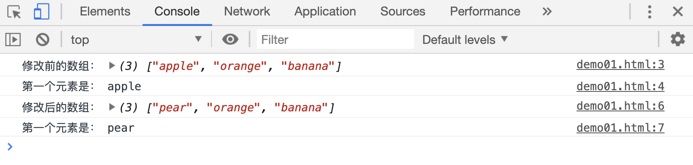

# JS 中的引用数据类型

引用数据类型，通常都表示的是一组数据。这里只简单介绍 2 种常用的： 数组(Array)和对象(Object)。

## 数组

一般来说，数组用来保存多个相同类型的数据，比如:

```js
var arr1 = [1, 3, 5, 7, 9];
var arr2 = ["a", "b", "c", "d", "e"];
```

但实际中，数组中也可保存多个不同类型的数据，这种使用方式是不推荐使用的。

```js
var arr = ["abc", 10, true, undefined, null];
```

数组中的每一个元素都有一个对应的正整数作为下标值，该下标值从 0 开始，从左到右依次加一。可以通过该下标值`获取或者修改`该位置的元素内容。

```html
<script>
    var arr = ["apple", "orange", "banana"];
    console.log("修改前的数组：", arr);
    console.log("第一个元素是：", arr[0]);
    arr[0] = "pear";
    console.log("修改后的数组：", arr);
    console.log("第一个元素是：", arr[0]);
</script>
```

[](./demo/demo01.html)



## 对象

对象通常表示一组属性的集合，比如一个轿车：

```js
var car = {
    color: "red", // 车身颜色：红色
    brand: "BMW", // 品牌：宝马
    year: 2018, // 出厂日期： 2018年
    isSuv: false, // 是否是SUV车型： 不是
};
```

上面声明的变量`car`的值，就是一个对象。对象通常使用`{}`包括起来。对象中`color brand year isSuv`叫做对象的属性，`red BMW 2018 false`叫做对象的属性值。

对象的属性和变量名一样，区分大小写，且推荐不要使用关键字。属性值可以是任意数据类型，甚至可以是一个数组，比如我们把车身颜色设置为一个数组，表示车身颜色有多种颜色：

```js
var car = {
    color: ["red", "green", "blue"], // 车身颜色：多种颜色
    brand: "BMW", // 品牌：宝马
    year: 2018, // 出厂日期： 2018年
    isSuv: false, // 是否是SUV车型： 不是
};
```

获取或修改对象的某个属性值，有两种方式：

```html
<script>
    var car = {
        color: "red", // 车身颜色：多种颜色
        brand: "BMW", // 品牌：宝马
        year: 2018, // 出厂日期： 2018年
        isSuv: false, // 是否是SUV车型： 不是
    };
    console.log("car.year: ", car.year);
    console.log('car["year"]: ', car["year"]);

    car.year = 2017;
    console.log("修改为2017后的car.year: ", car.year);
    console.log('修改为2017后的car["year"]: ', car["year"]);

    car["year"] = 2019;
    console.log("修改为2019后的car.year: ", car.year);
    console.log('修改为2019后的car["year"]: ', car["year"]);
</script>
```

[](./demo/demo01.html)


