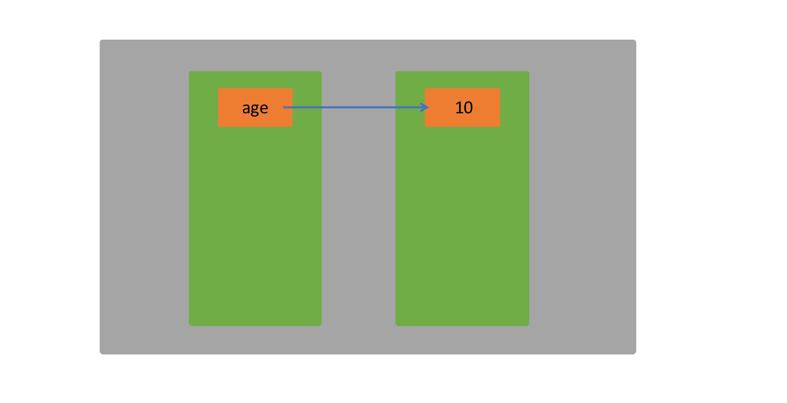
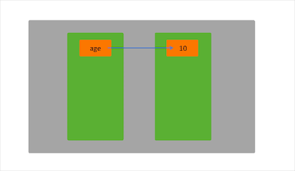
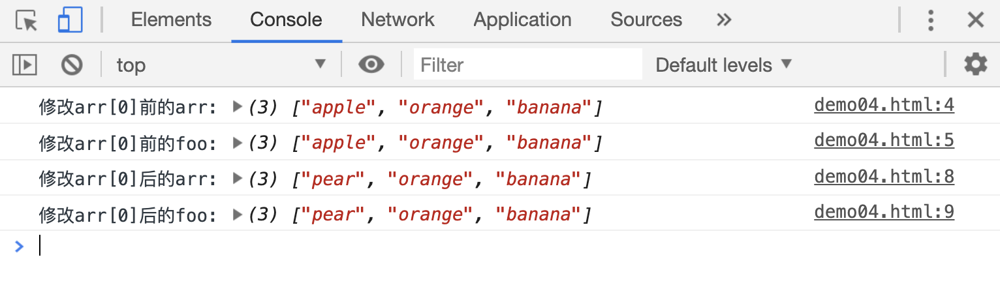
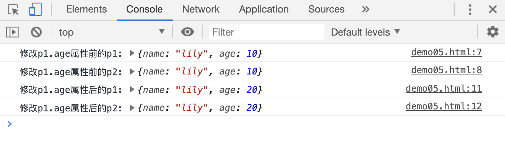
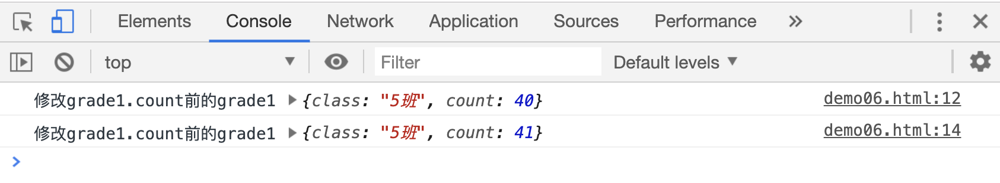
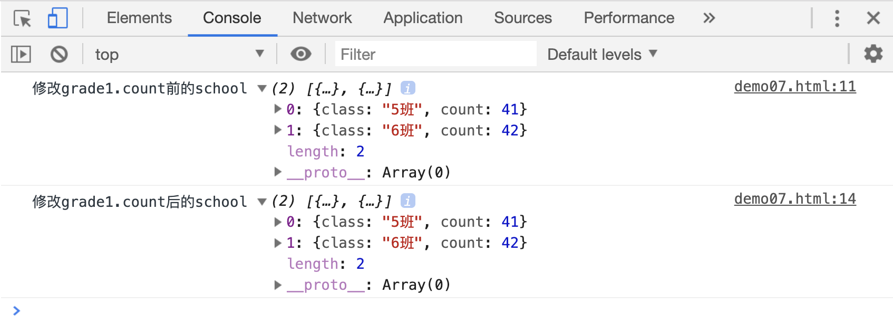
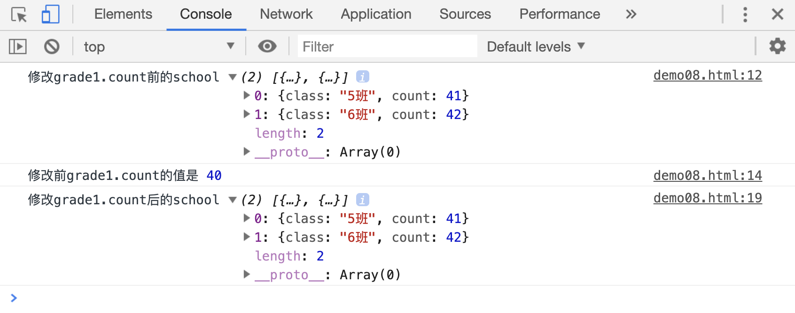

# 原始和引用数据类型的区别

JS 引擎在变量声明的时候，就要确认变量的值是哪种类型，便于分配内存空间。

## 原始数据类型

当变量值是原始数据类型时，计算机在内存中分配了一个区域，用来保存变量的值。再把这个区域和变量名建立一种联系。

比如:

```js
var age = 10;
```



那如果修改`age`的值为`20`呢？这里要记住一句话：原始数据类型有一个特点：只能重新赋值，不能被修改!

我们来看一个案例：

```js
var age = 10;
console.log(age); // 1
age = 20;
console.log(age); // 2
```

上面的案例中，声明变量`age`时，变量值`1`被保存在内存的一块区域中，等候其他的 JS 语句使用。

当`age`被重新赋值为`20`时，并不是说`10`的内容被改变为`20`，实际上是内存重新分配了一个区域来保存数据`20`，并把变量`age`的指向改到了`20`所在的内存区域。



此时数据`10`已经没有作用了，浏览器的垃圾回收机制，把`1`所在的内存区域清空，释放内存空间。

> 垃圾回收机制，指得是浏览器在某些条件下，自动把一些没用的数据清空，释放内存空间。

```html
<script>
    var a = 10;
    var b = a;
    console.log("a:", a);
    console.log("b:", b);

    a = 20;
    console.log("a:", a);
    console.log("b:", b);
</script>
```


在这个案例中，执行语句`b=a`时，并不是把`b`也指向`10`，而是把`10`在内存中拷贝了一份，再赋值给`b`。所以此时`a`和`b`指向的是两个不同的内存区域，修改`a`的值，不会影响`b`。

## 引用数据类型

### 数组

以数组为例，我们看一下内存的使用情况：

当变量值是数组时，计算机会在内存中分配一块区域，这个区域可以保存多个数据，并把变量名指向该区域。如果把变量值赋值给另一个变量名，并不会把这个区域拷贝一份，只是把新的变量名也指向该区域。这时，如果通过任意一个变量名，修改该区域的某个值，通过另一个变量名获取某个数据时，该数据也发生了变化。

```html
<script>
    var arr = ["apple", "orange", "banana"];
    var foo = arr;
    console.log("修改arr[0]前的arr:", arr);
    console.log("修改arr[0]前的foo:", foo);

    arr[0] = "pear";
    console.log("修改arr[0]后的arr:", arr);
    console.log("修改arr[0]后的foo:", foo);
</script>
```

[案例源码](./demo/demo04.html)




### 对象

对象和数组的原理其实是一样的：

```html
<script>
    var p1 = {
        name: "lily",
        age: 10,
    };
    var p2 = p1;
    console.log("修改p1.age属性前的p1:", p1);
    console.log("修改p1.age属性前的p2:", p2);

    p1.age = 20;
    console.log("修改p1.age属性后的p1:", p1);
    console.log("修改p1.age属性后的p2:", p2);
</script>
```

[案例源码](./demo/demo05.html)

案例中，`p1`和`p2`实际指向的是同一个区域，该区域中的任意一个值被修改后，两个变量的内容就都发生了变化。



### 数组和对象混合使用

```html
<script>
    var grade1 = {
        class: "5班",
        count: 40,
    };
    var grade2 = {
        class: "6班",
        count: 42,
    };
    var school = [grade1, grade2];

    console.log("修改grade1.count前的grade1", grade1);
    school[0].count = 41;
    console.log("修改grade1.count前的grade1", grade1);
</script>
```

[案例源码](./demo/demo06.html)



> 注意：浏览器中修改数组中元素时，可能会出现异常情况：

```html
<script>
    var grade1 = {
        class: "5班",
        count: 40,
    };
    var grade2 = {
        class: "6班",
        count: 42,
    };
    var school = [grade1, grade2];
    console.log("修改grade1.count前的school", school);

    grade1.count = 41;
    console.log("修改grade1.count后的school", school);
</script>
```

[案例源码](./demo/demo07.html)



修改前`grade1.count`的值应该是`40`才对，控制台中输出的确实`41`，这明明是修改后的值。这是因为 JS 引擎在计算的时候太快了，当浏览器接收到在控制台打印`school`命令的时候，`school`的值已经被修改了，这个时候打印出来的 school.grade1 的值，当然就是已经被修改后的值了。但是这仅仅是`console.log()`方法会出现这种问题，不影响 JS 中其他语句的使用。比如我们在上面的代码中添加一些代码：

```html
<script>
    var grade1 = {
        class: "5班",
        count: 40,
    };
    var grade2 = {
        class: "6班",
        count: 42,
    };

    var school = [grade1, grade2];
    console.log("修改grade1.count前的school", school);
    if (grade1.count == 40) {
        console.log("修改前grade1.count的值是", grade1.count);
    } else {
        console.log("修改前grade1.count的值是", grade1.count);
    }
    grade1.count = 41;
    console.log("修改grade1.count后的school", school);
</script>
```

[案例源码](./demo/demo08.html)



所以，这就是为什么数组和对象被称为“引用数据类型”的原因了。变量名只是指向一个内存区域，只要区域内的数据发生了变化，所有指针指向这两种数据的变量，在获取某个值的时候，结果会发生改变。
