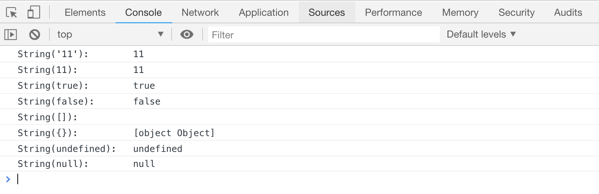
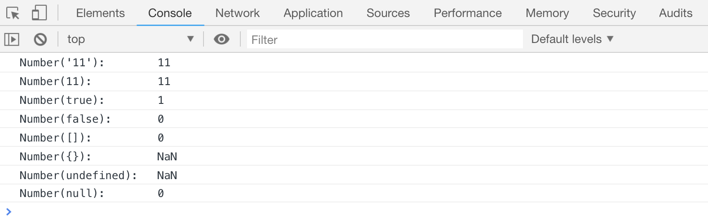
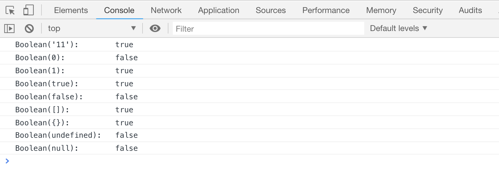

# JS 中数据类型的转换

在 JS 中可以强制转换目标的数据类型

## 把目标转成字符串

```html
<script>
    console.log("String('11'):        " + String("11"));
    console.log("String(11):          " + String(11));
    console.log("String(true):        " + String(true));
    console.log("String(false):       " + String(false));
    console.log("String([]):          " + String([]));
    console.log("String({}):          " + String({}));
    console.log("String(undefined):   " + String(undefined));
    console.log("String(null):        " + String(null));
</script>
```

[案例源码](./demo/demo01.html)



## 把目标转成数字

```html
<script>
    console.log("Number('11'):        " + Number("11"));
    console.log("Number(11):          " + Number(11));
    console.log("Number(true):        " + Number(true));
    console.log("Number(false):       " + Number(false));
    console.log("Number([]):          " + Number([]));
    console.log("Number({}):          " + Number({}));
    console.log("Number(undefined):   " + Number(undefined));
    console.log("Number(null):        " + Number(null));
</script>
```

[案例源码](./demo/demo02.html)



## 把目标转成布尔值

```html
<script>
    console.log("Boolean('11'):        " + Boolean("11"));
    console.log("Boolean(0):           " + Boolean(0));
    console.log("Boolean(1):           " + Boolean(1));
    console.log("Boolean(true):        " + Boolean(true));
    console.log("Boolean(false):       " + Boolean(false));
    console.log("Boolean([]):          " + Boolean([]));
    console.log("Boolean({}):          " + Boolean({}));
    console.log("Boolean(undefined):   " + Boolean(undefined));
    console.log("Boolean(null):        " + Boolean(null));
</script>
```

[案例源码](./demo/demo03.html)


