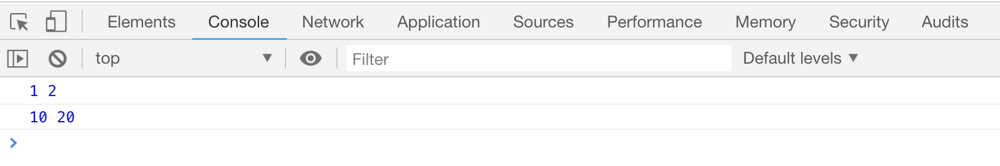
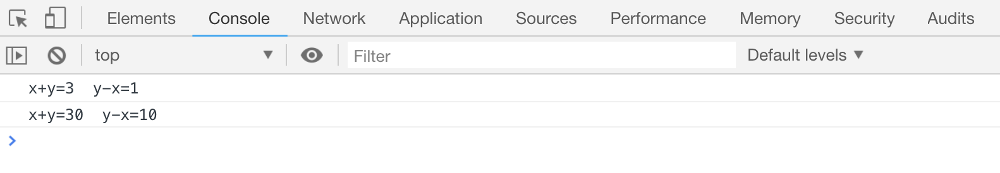

# JS 中的函数

当一段代码需要被**重复**使用的时候，就可以使用**函数**把代码块封装起来。

## 声明一个函数

```js
// 声明一个函数
function 函数名() {
    // 代码块...
}
```

如上所示，关键字`function`用来声明后面是一个函数，函数名是必须有的，大括号内是需要被重复执行的代码块。要注意：

-   这里的`function`必须是全小写
-   函数名是区分大小写的，也就是说`getname`和`getName`是两个不同的函数。
-   和声明变量一样，函数不能使用 JS 已有的关键字作为函数名

函数其实也是一个变量，上面的函数也可以这么写：

```js
var 函数名 = function() {
    // 代码块
};
```

## 执行函数

可以使用`函数名()`的格式执行一次函数内的代码块，也可以说是函数被`调用`了一次。 函数每次被调用，函数中的代码块都会被执行一次。下面的案例中。函数`sum`被调用了 2 次，开发工具的控制台中会输出两次数字`1`

```html
<script>
    function sum() {
        console.log(1);
    }
    sum();
    sum();
</script>
```

[案例代码](./demo/demo01.html)


## 调用带参数的函数

调用函数的时候，可以向函数中传入某种值，这些值被称为**参数**，

-   调用的时候可以同时传入多个参数，这些参数需要使用`,`隔开;
-   传入的参数可以在函数中按照传入的先后顺序获取到
-   声明函数时，小括号内的参数称作是`形参`，
-   调用函数时，小括号内的参数称作是`实参`

```html
<script>
    function sum(x, y) {
        console.log(x, y);
    }
    sum(1, 2);
    sum(10, 20);
</script>
```

[案例代码](./demo/demo02.html)



因此，我们可以让函数根据传入参数的不同。输出不同的结果

```html
<script>
    function sum(x, y) {
        console.log("x+y=" + (x + y), " y-x=" + (y - x));
    }
    sum(1, 2);
    sum(10, 20);
</script>
```

[案例代码](./demo/demo03.html)



## 函数的返回值

函数可以使用`return`关键字设置一个值，作为函数执行后的返回值，该返回值可以赋值给一个变量，保存下来。如果没有设置，默认返回`undefined`

```html
<script>
    function sum() {
        return 10;
    }
    var a = sum();
    console.log("a: " + a);

    function sum2() {}
    var b = sum2();
    console.log("b: " + b);
</script>
```

[案例代码](./demo/demo04.html)


配合函数的参数，我们可以让函数返回两个数字的和：

```html
<script>
    function sum(x, y) {
        return x + y;
    }
    console.log(sum(1, 2));
    console.log(sum(9, 10));
</script>
```

[案例代码](./demo/demo05.html)


注意：

-   如果在函数中使用了`return`，会导致该函数内`return`后的语句不会被执行。也就是说函数被终止了，
-   `return`可以在使用的时候，不设置任何值，此时函数的返回值依然是`unefined`,
-   函数内部的`return`也不会影响函数外面 JS 语句的执行。

```html
<script>
    function sum() {
        console.log(1);
        return;
        console.log(2);
    }
    sum();
    console.log(3);
</script>
```

[案例代码](./demo/demo06.html)


