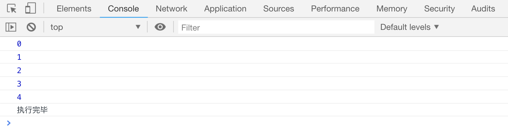
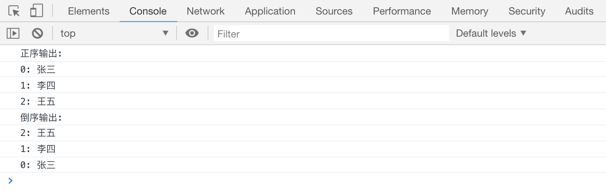

# JS 中的循环

循环的意思是，同一段代码连续执行 n 次。JS 中的循环语句有两种，一个是`for`循环，一个是`while`循环

## for 循环

简单的 for 循环：

```js
for (var x = 0; x < 10; x++) {
    console.log(x);
}
console.log("执行完毕");
```

[案例代码](./demo/demo01.html)



在上面的语句中：

-   `var x=0`声明一个变量，且定义了变量`x`的初始值，
-   `x<1`定义了代码块执行的条件。当`x<1`的时候，就会执行花括号中的代码块,
-   `x++`定义了代码块执行之后执行的语句。`x++`执行之后, 如果`x<10`就循环执行下去，直到`x<10`的结果为`false`，才会停止循环

## 使用 break 打断 for 循环

`for`循环中，可以使用关键字`break`打断循环(也叫**跳出**循环)

```js
for (var x = 0; x < 5; x++) {
    if (x == 3) {
        break;
    }
    console.log(x);
}
console.log("执行完毕");
```

[案例代码](./demo/demo02.html)


## 使用 continue 跳过一次 for 循环

`for`循环中，可以使用关键字`continue`跳过某次循环，当满足条件时，会直接从下一次循环继续，不再执行 `continue` 后面的语句

```js
for (var x = 0; x < 5; x++) {
    if (x == 3) {
        continue;
    }
    console.log(x);
}
console.log("执行完毕");
```

[案例代码](./demo/demo03.html)


## 使用 for 循环输出数组的内容

```js
// 正序输出：
console.log("正序输出：");
var arr = ["张三", "李四", "王五"];
for (var x = 0; x < 3; x++) {
    console.log(x + ": " + arr[x]);
}

// 倒序输出
console.log("倒序输出");
for (var y = 2; y >= 0; y--) {
    console.log(y + ": " + arr[y]);
}
```

[案例代码](./demo/demo04.html)



## for 循环输出九九乘法表

流程控制语句是可以嵌套使用的，这里使用嵌套来尝试输出一下九九乘法表

```html
<script>
    var row = "";
    for (var x = 1; x < 10; x++) {
        for (var y = 1; y <= x; y++) {
            row += x + "*" + y + "=" + x * y + " ";
        }
        console.log(row);
        row = "";
    }
</script>
```

[案例代码](./demo/demo05.html)


## for 循环输出金字塔
