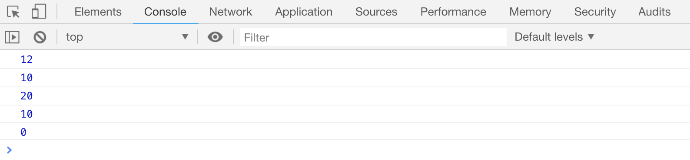

# 赋值运算符

赋值运算符用于给变量赋值，比如`var name = 'zhangsan;`语句中的`=`就是一个赋值运算符，除了`=`，还有以下赋值运算符：

假设`x=10, y=2`:

| 运算符   | 含义             | x 的结果 |
| -------- | ---------------- | -------- |
| `x = y`  | 直接赋值         | 2        |
| `x += y` | 相当于 `x = x+y` | 12       |
| `x -= y` | 相当于 `x = x-y` | 8        |
| `x *= y` | 相当于 `x = x*y` | 20       |
| `x /= y` | 相当于 `x = x/y` | 5        |
| `x %= y` | 相当于 `x = x%y` | 0        |

[案例代码](./demo/demo01.png)



## 赋值运算符与自增自减运算符

当赋值运算符和自增、自减运算符在一起使用的时候，要看自增、自减运算符的具体位置

```js
// 后置自减运算符
var x = 1;
var y = x++;
console.log(x, y); // 2,1

// 前置自减运算符
var x = 1;
var y = ++x;
console.log(x, y); // 2,2
```
