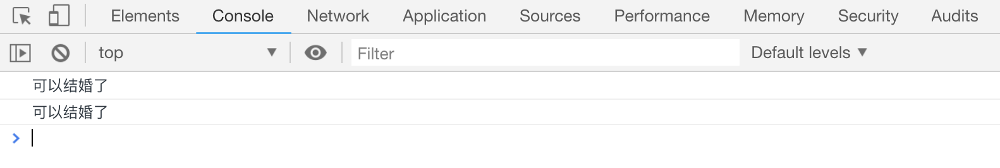

# 逻辑运算符

逻辑运算符通常与比较运算符同时使用，返回一个**布尔值**。包含以下三种：

| 运算符 | 含义 |
| ------------ | ---- |
| `&&` | 且 |
| &#124;&#124; | 或 |
| `!`| 非 |

## `&&`运算符

只有前面和后面同时为 `true` 的时候，结果才返回 `true`，否则返回 `false`(任意一条语句为 `false`，结果一定是 `false`)

```js
console.log(3 > 2 && 3 > 1); // true
console.log(3 > 2 && 3 < 1); // false
console.log(3 < 2 && 3 > 1); // false
```

连续的`&&`运算符中，只要碰到返回值为`false`的语句，浏览器会自动停止执行后面的语句

## `||`运算符

左右两边只要有一个为 `true`，最终结果就为 `true`,(如果两边均为`false`，最终结果是`false`)

```js
console.log(3 > 2 || 3 > 1); // true
console.log(3 > 2 || 3 < 1); // true
console.log(3 < 2 || 3 > 1); // true
```

连续的`||`运算符中，只要碰到返回值为`true`的语句，，浏览器会自动停止执行后面的语句

## `!`运算符

通常表示**取反**，即和它后面的布尔值正好相反

```js
console.log(!(3 > 2)); // false
console.log(!(3 < 2)); // true
```

## 使用`&&`运算符代替 `if` 语句

> 连续的`&&`运算符中，只要碰到返回值为`false`的语句，浏览器会自动停止执行后面的语句

根据这个特点，可以用`&&`运算符来适当的代替`if`语句，比如

```html
<script>
3 < 2 && console.log("执行第一条语句");
3 > 2 && console.log("执行第二条语句");
</script>
```

[案例代码](./demo/demo01.html)


再看一个案例：

> 男孩不小于 22 岁，女孩不小于 20 岁的人才能结婚

```html
<script>
var boy = 22,
girl = 21;

if (boy >= 22 && girl >= 20) {
console.log("可以结婚了");
}

// 用&&代替if
boy >= 22 && girl >= 20 && console.log("可以结婚了");
</script>
```

[案例代码](./demo/demo02.html)


