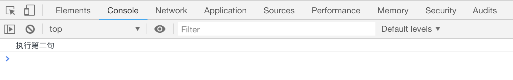

# JS 中的三元运算符

```html
<script>
3 > 4 ? console.log("执行第一句") : console.log("执行第二句");
</script>
```

[案例代码](./demo/demo01.html)



可以看出，三元运算符，直接代替`if...else...`语句,再来看一个复杂的

```html
<script>
var x = 8;

if (x > 5) {
if (x > 7) {
console.log("x>7");
} else {
console.log("x<7");
}
} else {
if (x > 3) {
console.log("x>3");
} else {
console.log("x<3");
}
}
// 使用三元运算符代替
x > 5
? x > 7
? console.log("x>7")
: console.log("x<7")
: x > 3
? console.log("x>3")
: console.log("x<3");
</script>
```

[案例代码](./demo/demo02.html)


