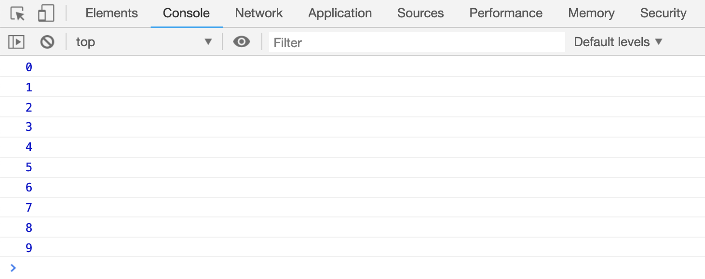

# do...while 循环

```js
do {
    语句;
} while (条件);
```

`do...while...`循环和`while`循环刚好相反，先执行大括号中的语句，再判断条件，只要条件表达式为`true`,大括号内的语句会持续执行下去，当条件表达式为`false`的时候，才会终止循环

## 循环输出 0-9 的数字

```html
<script>
    var x = 0;

    while (x <= 9) {
        console.log(x);
        x++;
    }
</script>
```

[案例代码](./demo/demo01.html)



## 循环输出数组中的内容

```html
<script>
    var arr = ["张三", "李四", "王五"];

    // 正序输出
    console.log("正序输出: ");
    var x = 0;
    do {
        console.log(x + ": " + arr[x]);
        x++;
    } while (x <= 2);

    // 倒序输出
    console.log("倒序输出: ");
    var y = 2;
    do {
        console.log(y + ": " + arr[y]);
        y--;
    } while (y >= 0);
</script>
```

[案例代码](./demo/demo02.html)


## 使用 break 打断循环

和`while`一样，`break`也可以用来打断`do...while...`循环

```html
<script>
    var x = 5;
    do {
        if (x == 2) {
            break;
        }
        console.log(x);
        x--;
    } while (x > 0);
</script>
```

[案例代码](./demo/demo03.html)


