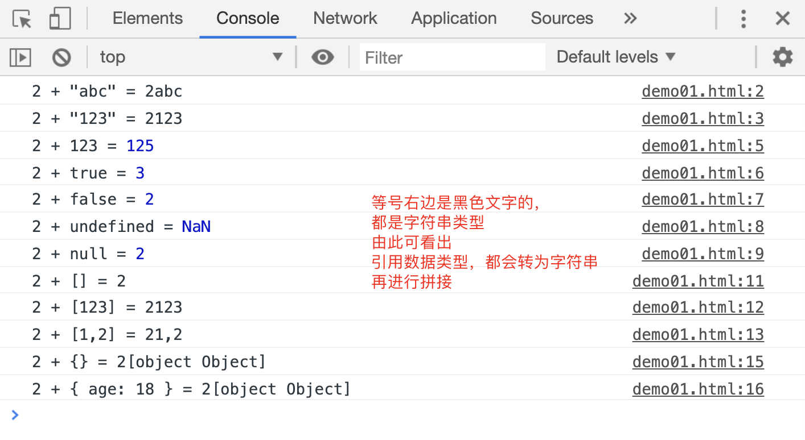

# 数据类型的隐式转换

上一节中，`if`语句中条件表达式的返回值如果不是布尔值，，JS 引擎偷偷的把表达式本身或者它的返回值转换成布尔值，这种转换过程，被称为“隐式转换”。

```html
<script>
if (1) {
console.log(1);
} else {
console.log(2);
}
</script>
```

[案例源码](./demo/demo01.html)


事实上，除了`if`，前面讲过的`三元运算符`，以及后面即将讲到的`while`，都可能发生数据类型的隐式转换。

```html
<script>
undefined ? console.log(1) : console.log(2);
</script>
```

[案例源码](./demo/demo02.html)


如果取反运算符`!`的后面跟着一个非布尔值数据类型，也会隐式转换为布尔值

```html
<script>
!undefined ? console.log(1) : console.log(2);
</script>
```

[案例源码](./demo/demo03.html)


> 注意：这里就要考虑到运算符的优先级关系了，上面的案例中，取反运算符的优先级大于三元运算符，所以会先执行取反运算符，判断三元运算符中的条件表达式结果，再执行三元运算符。

## 算数运算符中的隐式转换

原则上来说，算数运算符左右两边应该都是数值类型，所有的数据类型，都要转为数值再进行算数运算。但实际上按照运算符的不同，执行的结果也有所不同。

### `+`运算符

- 如果任意一边为字符串类型，则`+`用作字符串拼接

- 如果运算符两边有字符串之外的原始数据类型，需要转为数值类型，再进行运算

- 如果运算符两边有引用数据类型，需要先转为字符串，再进行字符串拼接

```html
<script>
console.log('2 + "abc"', "=", 2 + "abc");
console.log('2 + "123"', "=", 2 + "123");

console.log("2 + 123", "=", 2 + 123);
console.log("2 + true", "=", 2 + true);
console.log("2 + false", "=", 2 + false);
console.log("2 + undefined", "=", 2 + undefined);
console.log("2 + null", "=", 2 + null);

console.log("2 + []", "=", 2 + []); // 在console面板中，输出的2是黑色文字，是一个字符串类型
console.log("2 + [123]", "=", 2 + [123]);
console.log("2 + [1,2]", "=", 2 + [1, 2]);

console.log("2 + {}", "=", 2 + {});
console.log("2 + { age: 18 }", "=", 2 + { age: 18 });
</script>
```

[源码案例](./demo/demo04.html)


### `- * / ==`运算符：

- 如果运算符两边有原始数据类型，则将他们转为数字后进行运算

- 如果运算符两边有引用数据类型，先将它们转为字符串，再转为数值类型，最后进行算数运算

```html
<script>
console.log('2 - "abc"', "=", 2 - "abc");
console.log('2 - "123"', "=", 2 - "123");

console.log("2 - 123", "=", 2 - 123);
console.log("2 - true", "=", 2 - true);
console.log("2 - false", "=", 2 - false);
console.log("2 - undefined", "=", 2 - undefined);
console.log("2 - null", "=", 2 - null);

console.log("2 - []", "=", 2 - []); // 在console面板中，输出的2是黑色文字，是一个字符串类型
console.log("2 - [123]", "=", 2 - [123]);
console.log("2 - [1,2]", "=", 2 - [1, 2]);

console.log("2 - {}", "=", 2 - {});
console.log("2 - { age: 18 }", "=", 2 - { age: 18 });
</script>
```

[源码案例](./demo/demo05.html)


