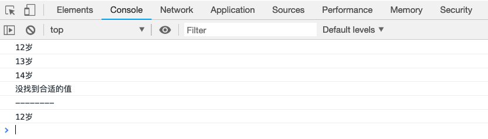

# switch 语句

switch 语句通过根据一系列与目标值的对比判断，绝对执行哪一步分代码块。

- `switch` 后的括号内放入目标值
- `case`语句后跟一个对比值，当目标值`全等于`目标值的时候，会执行`case`中的语句
- `case`语句中如果有`break`关键字，语句执行完后，会退出整个`switch`语句。否则会依次执行下一个`case`
- 当所有`case`后面的值和目标值不匹配的时候，会执行`default`后的语句。

> switch 语句不能用来做范围的判断，她的目标值和对比值只做全等于判断`===`，因此一定要注意目标值和对比值的值和类型

```js
var age = 12;

switch (age) {
case 10:
console.log("10岁");
case 11:
console.log("11岁");
case 12:
console.log("12岁");
case 13:
console.log("13岁");
case 14:
console.log("14岁");
default:
console.log("没找到合适的值");
}
console.log("--------");
switch (age) {
case 10:
console.log("10岁");
case 11:
console.log("11岁");
case 12:
console.log("12岁");
break;
case 13:
console.log("13岁");
case 14:
console.log("14岁");
default:
console.log("没找到合适的值");
}
```

[案例代码](./demo/demo01.html)


