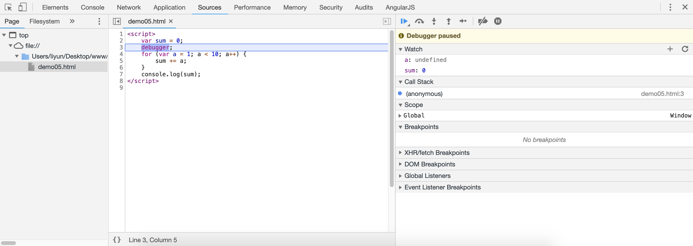

# 在浏览器中调试 JS 代码

在编写 JS 代码的时候，代码中可能会出现语法错误，或者逻辑错误，如果没有相应的调试工具来发现这些错误，是一件很痛苦的事情。

## 语法错误

语法错误，最常见的蘑菇与标点符号错误，或者是关键字写错了。这些语法错误可以在浏览器开发者工具的`console`面板中查看。

例如：

```html
<script>
    var a = 0；
    var b = a++;
</script>
```

[案例源码](./demo/deomo01.html)


上图中的错误提示意思就是代码中出现了`语法错误`！

## 逻辑错误

逻辑错误值得是 JS 最终执行结果，和预期结果有差异，这种错误只靠眼睛往往是很难检查出来的。

在早期的页面开发工作中，调试 JS 代码，通常会使用`alert()`和`console.log()`方法来进行调试。比如在代码运行过程中，观察目标变量的值等操作。

```html
<script>
    var sum = 0;
    for (var a = 1; a < 10; a++) {
        sum += a;
        alert(sum);
    }
    console.log(sum);
</script>
```

上面的案例中，可以通过每次循环过程中使用 alert 方法来观察 sum 值的变化。但问题是，这些弹窗太多了。每次都要手动点击，才能继续执行下去。

> `alert()`方法会阻塞 JS 执行

所以跟多时候会使用`console.log()`方法调试 JS 代码。

```html
<script>
    var sum = 0;
    for (var a = 1; a < 10; a++) {
        sum += a;
        console.log(sum);
    }
    console.log(sum);
</script>
```

[案例源码](./demo/deomo03.html)


## 断点调试

现在大多数浏览器的开发者工具都为开发人员提供了“断点调试”的功能，也就是说在想要调试的位置加入一个断点，从该位置开始监控想要查看的变量，提高解决逻辑问题的效率。

断点调试功能在浏览器开发者工具的`sources`面板中：
[案例源码](./demo/deomo04.html)


-   选中当前页面的文件，点击代码所在的行数数字，可以添加断点
-   刷新页面后，JS 会在断点的位置暂停执行
-   按下`F11`，或者点击对应的位置，可以分步执行 JS
-   分步执行 JS 的时候，可以在每一步执行的过程中，鼠标放在变量名上，查看变量当前的值
-   `watch`面板可以新增或删除要观察的变量

## debugger 关键字

在 JS 代码中插入`debugger`关键字，也可以实现插入断点的功能，执行到此位置时，浏览器会自动暂停执行。

```html
<script>
    var sum = 0;
    debugger;
    for (var a = 1; a < 10; a++) {
        sum += a;
    }
    console.log(sum);
</script>
```

[案例源码](./demo/deomo05.html)


