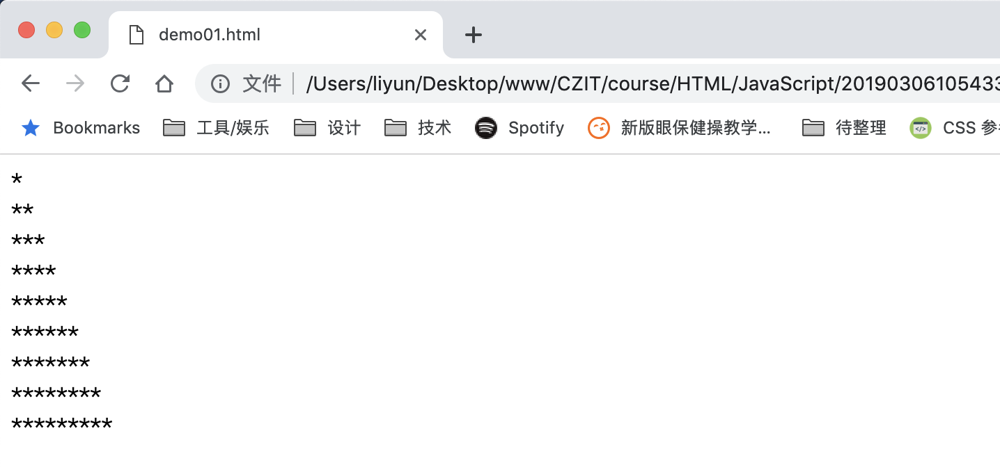
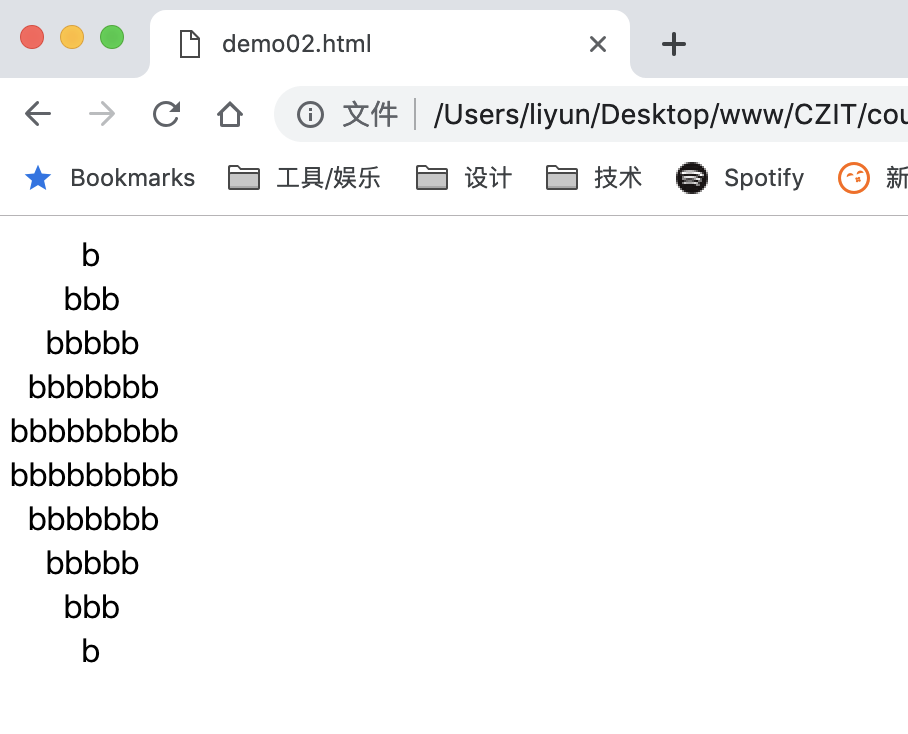
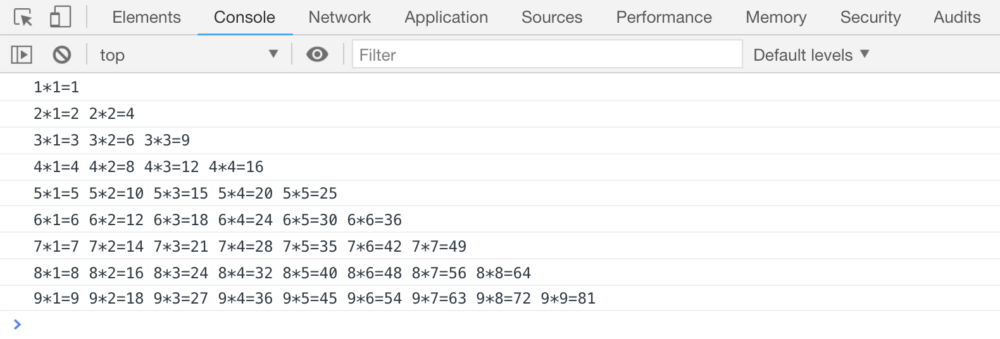

# for 循环案例

## for 循环输出直角三角形

流程控制语句是可以嵌套使用的，这里使用嵌套来尝试输出一个直角三角形

```html
<script>
    var row = "";
    for (var x = 1; x < 10; x++) {
        for (var y = 1; y <= x; y++) {
            row = row + "*";
        }
        console.log(row);
        row = "";
    }
</script>
```

[案例代码](./demo/demo01.html)



## for 循环输出金字塔

```html
<script>
    var row = 5;
    // 正序输出金字塔
    for (var k = 1; k <= row; k++) {
        for (var m = 1; m <= row - k; m++) {
            document.write("<span style='color: transparent;'>a</span>");
        }
        for (var n = 1; n <= 2 * k - 1; n++) {
            document.write("b");
        }
        document.write("<br/>");
    }

    // 倒序输出金字塔
    for (var k = 1; k <= row; k++) {
        for (m = 1; m <= k - 1; m++) {
            document.write("<span style='color: transparent;'>a</span>");
        }
        for (var n = 1; n <= row * 2 + 1 - k * 2; n++) {
            document.write("b");
        }
        document.write("<br/>");
    }
</script>
```

[案例代码](./demo/demo02.html)



## for 循环输出九九乘法表

```html
<script>
    var row = "";
    for (var x = 1; x < 10; x++) {
        for (var y = 1; y <= x; y++) {
            row += x + "*" + y + "=" + x * y + " ";
        }
        console.log(row);
        row = "";
    }
</script>
```

[案例代码](./demo/demo03.html)


