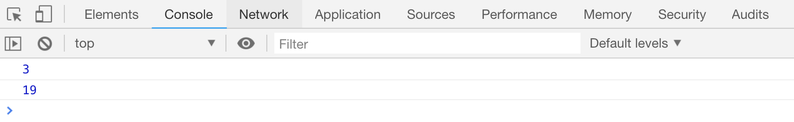
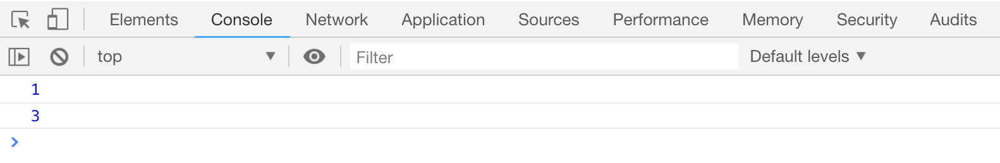

# JS 中函数的返回值

函数可以使用`return`关键字设置一个值，作为函数执行后的返回值，该返回值可以赋值给一个变量，保存下来。如果没有设置，默认返回`undefined`

```html
<script>
    function sum() {
        return 10;
    }
    var a = sum();
    console.log("a: " + a);

    function sum2() {}
    var b = sum2();
    console.log("b: " + b);
</script>
```

[案例代码](./demo/demo04.html)


配合函数的参数，我们可以让函数返回两个数字的和：

```html
<script>
    function sum(x, y) {
        return x + y;
    }
    console.log(sum(1, 2));
    console.log(sum(9, 10));
</script>
```

[案例代码](./demo/demo05.html)



注意：

-   如果在函数中使用了`return`，会导致该函数内`return`后的语句不会被执行。也就是说函数被终止了，
-   `return`可以在使用的时候，不设置任何值，此时函数的返回值依然是`unefined`,
-   函数内部的`return`也不会影响函数外面 JS 语句的执行。

```html
<script>
    function sum() {
        console.log(1);
        return;
        console.log(2);
    }
    sum();
    console.log(3);
</script>
```

[案例代码](./demo/demo06.html)


