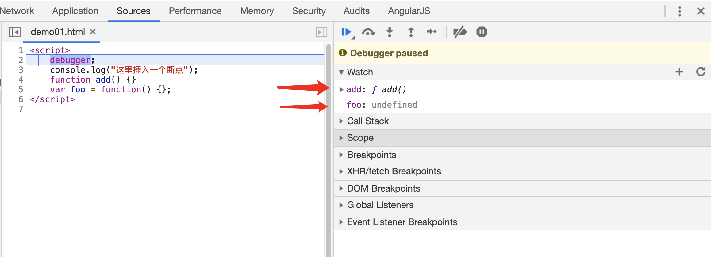
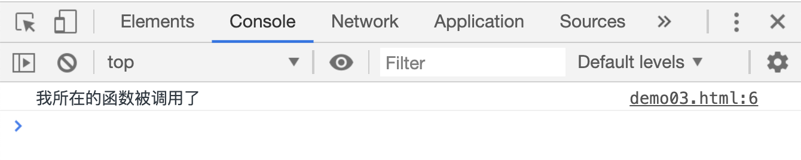
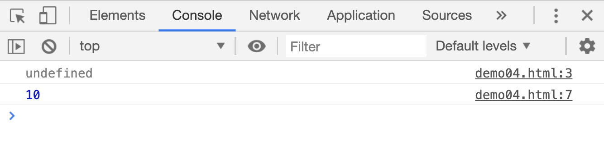
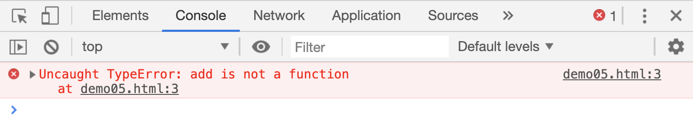

# JS 的执行顺序

首先，JS 是一种单线程语言，什么意思呢？从筒子里面取羽毛球的时候，只有先把上面的羽毛球取出来，才能挨个取出下面的羽毛球。JS 中的语句也要按照从上到下的顺序去执行，只有上一条语句执行完毕，才会执行下一条语句。

```html
<script>
    alert(2);
    alert(5);
    alert(8);
</script>
```

[源码案例](./demo/demo01.html)

比如上面的代码放在浏览器中执行，肯定是按照 2，5，8 的顺序显示弹窗。但是在 JS 中有一种代码是可以被`优先提取`的: 变量声明和函数声明。

先看一个之前讲过的东西：

```js
function add() {}
var add = function() {};
```

前面讲过这两种写法，前一种方式叫做：`函数声明`，后一种方式叫做：`变量声明`。虽然都可以通过`add()`调用，但是在 JS 执行顺序中却是大不一样。

```html
<script>
    debugger;
    console.log("这里插入一个断点");
    function add() {}
    var foo = function() {};
</script>
```

[源码案例](./demo/demo02.html)



注意看上图箭头部分，通过开发者工具，我们在`watch`面板中，监控了两个变量`add`和`foo`，断点执行之前，你会发现`add`的值已经被确定为一个函数了，`foo`的值却还是一个`undefined`。这是为什么呢？

在 JS 中，JS 引擎会在所有代码中优先提取所有的`函数声明`和`变量声明`，提前保存在内存中，便于在整段 JS 代码中调用和使用。但是这两者优先提取的过程是不同的。

`函数声明`在优先提取的过程中，函数名和函数内容会被全部保存到内存中去，所以我们可以在函数声明之前调用函数。

```html
<script>
    add();

    function add() {
        console.log("我所在的函数被调用了");
    }
</script>
```

[源码案例](./demo/demo03.html)



而`变量声明`在优先提取的时候，只会保存变量名，只有在执行到该语句的时候，才会被赋值。

```html
<script>
    // 在变量被赋值前，使用变量，变量的值是undefined
    console.log(add);

    var add = 10;

    console.log(add);
</script>
```

[源码案例](./demo/demo04.html)



所以如果想使用`var`声明一个函数类型的变量，只能在赋值语句之后调用，赋值之前变量的值是`undefined`，强制调用的话，JS 引擎会抛出一个错误，并终止运行。

```html
<script>
    // 变量add还没有被赋值，调用时会抛出错误
    add();

    var add = function() {
        console.log("我被调用了");
    };
</script>
```

[源码案例](./demo/demo05.html)



JS 引擎中，优先提取变量到内存的这个过程，被称为`变量提升`。
