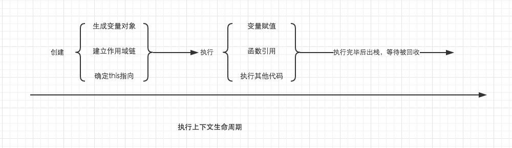
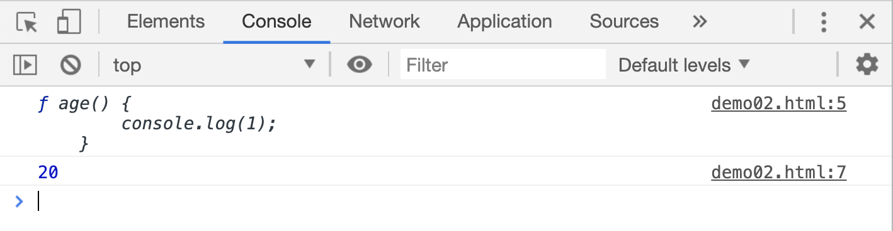
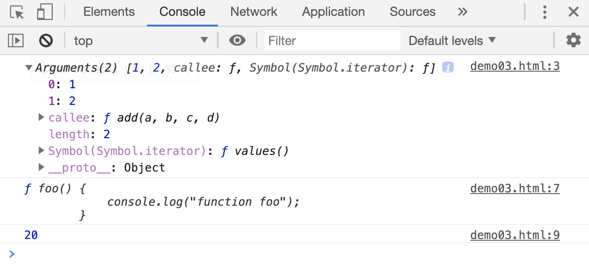
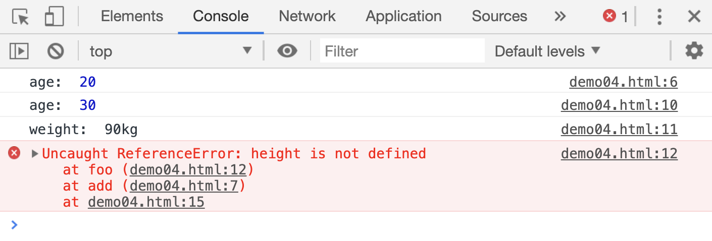
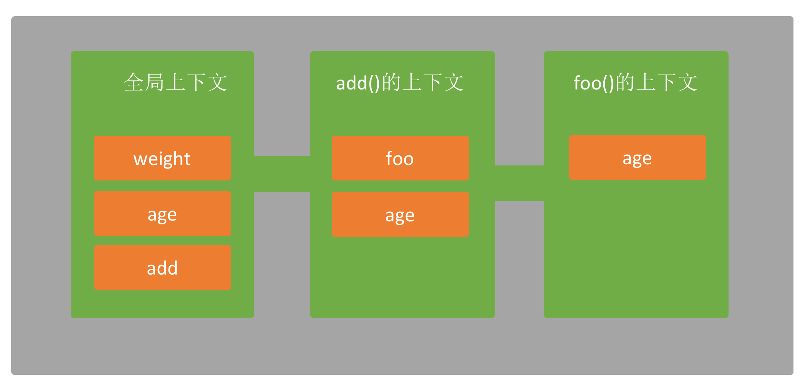
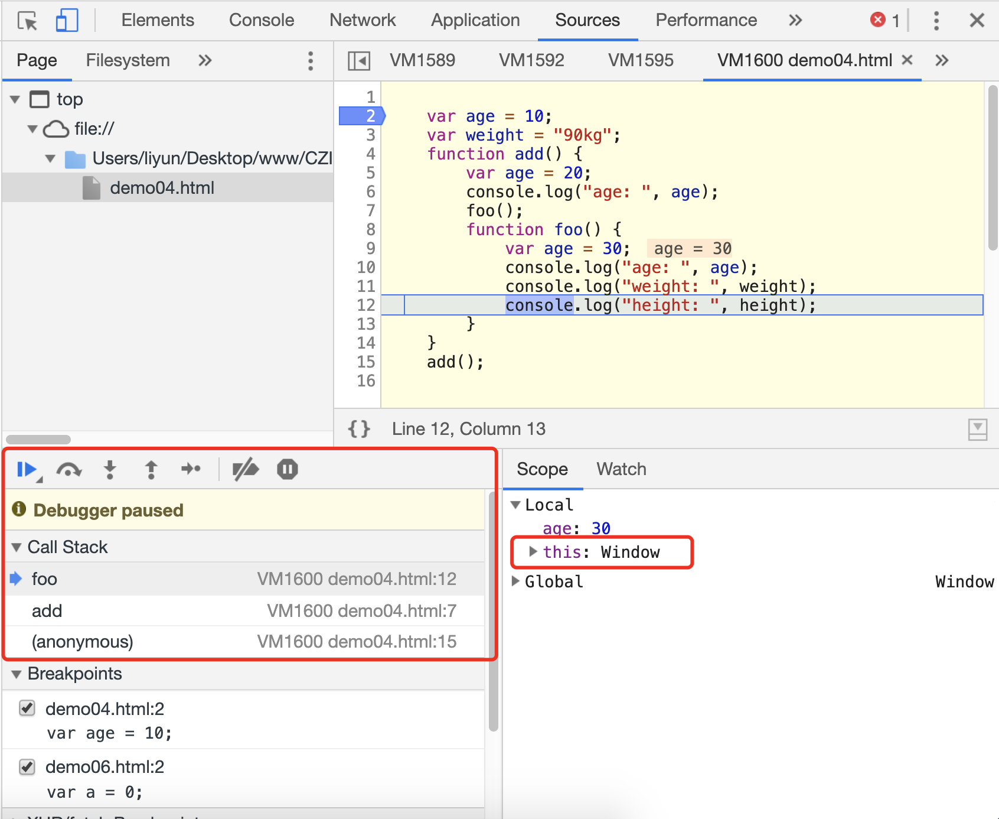
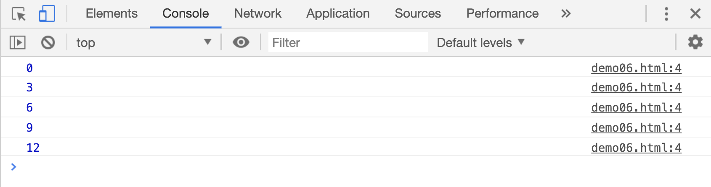
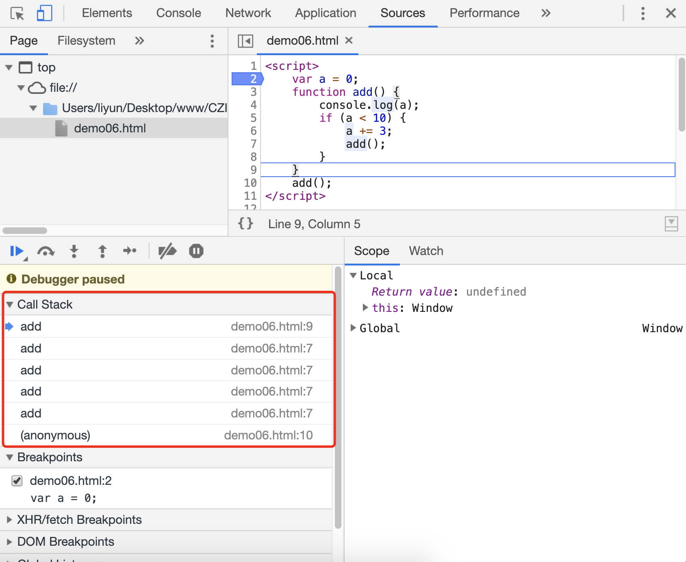

# JS 的执行顺序 2

## 执行上下文

JS 在开始执行之前，浏览器会先创建一个环境，用来保存执行当前代码所需要用到的所有变量和函数声明，这个环境被称为“全局执行上下文”。

函数在执行的时候，也会创建这么一个执行环境，被称为“函数执行上下文”。

这个“执行上下文”是有生命周期的，也就是说它有自己的创建、执行和销毁过程。



## 变量对象

变量对象内包含三种类型，且按照以下顺序依次创建：

1.arguments 对象，该对象只会在函数执行上下文中创建。
2.检查当前环境中所有的函数声明，把函数名作为属性，保存在当前的执行上下文对象中，并和函数(所在的内存地址)建立引用关系，便于后续调用。如果在上下文对象中发现已经存在的同名属性，则让属性与新的函数(所在的内存地址)建立引用关系。
3.检查当前环境中所有的变量声明，把变量名作为属性，保存在当前的执行上下文对象中，此时的属性值为`undefined`；如果在上下文对象中发现已经存在的同名属性，则会直接跳过。这是为了防止把之前的同名函数属性值修改为`undefined`

> 全局作用域下，变量对象相当于 window

每个数据所在的内存都有一个对应的编号，这个编号被叫做“内存地址”，变量实际上指向的是这个内存地址。比如：

```js
function add() {
console.log(1);
}
function add() {
console.log(2);
}
```

上面两个函数的具体内容会被保存在不同的内存中，拥有不同的内存地址。根据生成变量对象的规则，第二次声明`add`函数时，执行上下文中被发现已经有一个`add`属性，且指向了一个内存地址，此时会把执行上下文中`add`属性的指针指向第二个函数所在的内存地址。(也就是说后声明的函数会覆盖前面的同名函数内容。)

```js
function age() {
console.log(1);
}
var age = 20;
```

上面代码中，`age`函数声明被先提取到执行上下文中，指向了函数所在的内存地址。当 JS 引擎发现又有一个`age`变量声明时，会跳过创建这个属性，因为变量声明一旦创建，它的初始值是`undefined`。

另外，从规则中可以看出，提取函数`function`声明的优先级要高于变量`var`声明。我们看下面这个案例：

```html
<script>
function age() {
console.log(1);
}
console.log(age);
var age = 20;
console.log(age);
</script>
```

[案例源码](./demo/demo02.html)



上面案例代码执行顺序如下：

1. 发现函数声明 `age`
2. 把 `age` 保存为变量对象的属性，属性值设置为函数内容
3. 发现变量声明 `age`
4. 变量对象中已存在 `age` 属性，跳过这个变量的声明语句
5. 输出 `age`，此时 `age` 的属性值是一个函数
6. 重新把 `age` 属性值赋值为`20`
7. 输出 `age`，此时 `age` 的属性值是数字 20，不再是函数

## 函数内的变量对象

函数执行时创建的执行上下文中，多创建了一个`arguments`对象，可以通过该对象获取到函数执行时传入的所有参数。函数声明和变量声明的提取方式和全局上下文中相同

```html
<script>
function add(a, b, c, d) {
console.log(arguments);
function foo() {
console.log("function foo");
}
console.log(foo);
var foo = 20;
console.log(foo);
}
add(1, 2);
</script>
```

[案例源码](./demo/demo03.html)



> `arguments`对象是一个类数组，可以通过`下标`获取传入的参数

## 建立作用域链

建立作用域链更多的表现在函数内。前面说过: 函数在执行的时候，也会创建一个“函数执行上下文”。函数内所用到的变量和函数，会先从本身的执行上下文中查找，如果没有找到，会沿着作用域链向上查找。如果作用域链上也没有找到该变量或函数时，JS 会抛出错误。

```html
<script>
var age = 10;
var weight = "90kg";
function add() {
var age = 20;
console.log("age: ", age);
foo();
function foo() {
var age = 30;
console.log("age: ", age);
console.log("weight: ", weight);
console.log("height: ", height);
}
}
add();
</script>
```

[案例源码](./demo/demo04.html)






在内存中保存数据，有两种方式，一种是将数据保存在内存的`栈`中，一种是将数据保存在内存的`堆`中，原始类型数据和变量名都保存在内存的`栈`中，引用类型数据都保存在内存的`堆`中。

`堆`和`栈`表示的是一种保存数据的方式(算法)。正是这个算法确定了原始数据类型和引用数据类型的使用方式(原始数据类型，只能重新赋值，不能直接修改；复制原始类型数据时候，会拷贝一份到新的内存地址中。复制引用类型数据时，只是在变量和引用地址之间新增一个指针)

那么前面代码执行的过程中，每一次创建上下文，都可以看做是一次`入栈`操作。函数在全部执行完成后，会自动销毁函数的上下文，这个过程可以看做是一次`出栈`操作。全局上下文会在关闭浏览器窗口后被销毁，这个过程也属于`出栈`。

所以上面代码中的出栈入栈顺序如下：

1. 全局上下文入栈
2. 函数`add`上下文入栈
3. 函数`foo`上下文入栈
4. 函数`foo`上下文出栈
5. 函数`add`上下文出栈
6. 关闭浏览器窗口时，全局上下文出栈

## 确定 this 指向

确定 this 指向，是在建立作用域链之后发生的，全局作用域和函数作用域中的 this 会在创建执行上下文的时候确定指向。具体可以参考之前的`神奇的this`一篇。

出入栈和确定 this 指向的过程都可以从开发者工具栏中查看，以上一段代码为例：



## 执行其他语句

执行上下文创建之后，JS 进入语句执行过程，此时会按照自上而下的顺序，依次执行 JS 语句。

最后再来看一个自调用函数的案例：

```html
<script>
var a = 0;
function add() {
console.log(a);
if (a < 10) {
a += 3;
add();
}
}
add();
</script>
```

[案例源码](./demo/demo06.html)



自调用函数每调用一次，都会创建一个新的执行上下文。


