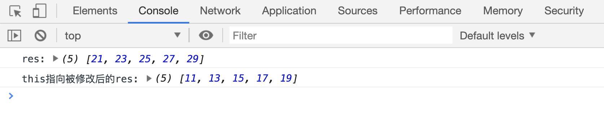
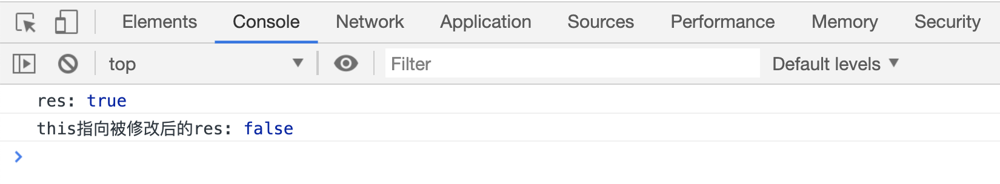

# 神奇的 this(补充)

前面讲过的数组方法中，有一些方法需要传入一个匿名函数作为参数，这些匿名函数的调用方式，实际上也是单独调用，也就是说函数中的`this`指向的是`window`对象。

但是这些方法实际上还可以传入第二个参数，用来修改第一个参数匿名函数中 this 的指向，比如： `map、forEach、find、findIndex、every、some、filter`方法；以`map`方法为例：

```html
<script>
var age = 20;
var arr = [1, 3, 5, 7, 9];

var res = arr.map(function(currentValue) {
return currentValue + this.age;
});
console.log("res:", res);

var person = {
age: 10,
};
// 把this指向修改为person对象
res = arr.map(function(currentValue) {
return currentValue + this.age;
}, person);
console.log("this指向被修改后的res:", res);
</script>
```

[代码案例](./demo/demo01.html)



案例中第二个参数传入`person`后，匿名函数中的`this`指向被修改为`person`，所以`this.age`的值变成了 10。

`every`方法中的`thisTarget`参数同样如此：

```html
<script>
var age = 0;

var arr = [1, 3, 5, 7, 9];

var res = arr.every(function(currentValue) {
return currentValue > this.age;
});
console.log("res:", res);

var person = {
age: 3,
};
// 把this指向修改为person对象
res = arr.every(function(currentValue) {
return currentValue > this.age;
}, person);
console.log("this指向被修改后的res:", res);
</script>
```

[代码案例](./demo/demo02.html)



其他几个可以修改`this`指向的案例就不再赘述了。
