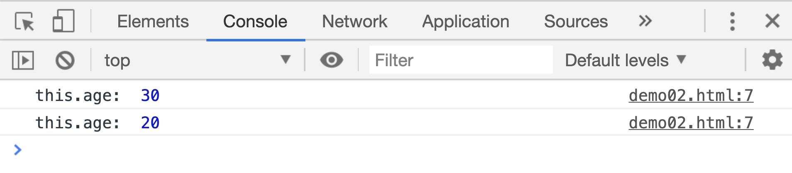

# 改变函数的 this

前面说函数中 `this` 的具体意义是在函数被调用时确定的。函数在没有调用者时，函数内部的`this`指向的是`window`对象：

```js
function add() {
console.log(this === window); // true
}
add();
```

JS 提供了三个函数可以在函数单独调用时，改变函数内`this`的指向:`bind() 、 call()， apply()`,这三个方法都是函数的属性，用法如下：

## bind()

`bind()`函数返回一个新的函数，这个函数在单独执行时，它里面的 `this` 被改变了。

```html
<script>
var age = 30;
var p1 = {
age: 20,
};
function add() {
console.log("this.age: ", this.age);
}
add();
var newFn = add.bind(p1);
newFn();
</script>
```

[案例源码](./demo/demo01.html)


## call()

`call()`函数可以在改变函数中 this 的同时调用直接调用一次函数：

```html
<script>
var age = 30;
var p1 = {
age: 20,
};
function add() {
console.log("this.age: ", this.age);
}
add();
add.call(p1);
</script>
```

[案例源码](./demo/demo02.html)



`call()`在调用函数的时候，还可以按照普通调用函数的方式，给原函数传递参数：

```html
<script>
var age = 30;
var p1 = {
age: 20,
};
function add(x, y) {
console.log("x: ", x, "y: ", y);
console.log("this.age: ", this.age);
}
add("zhangXueTong", 14);
add.call(p1, "liZhi", 14);
</script>
```

[案例源码](./demo/demo03.html)


## apply()

`apply()`和`call()`很相似，都是在改变函数内 this 的同时，调用一次函数。但是`apply`传递参数的方式不同，`apply`如果想传递参数，需要把参数放在一个数组中去：

```html
<script>
var age = 30;
var p1 = {
age: 20,
};
function add(x, y) {
console.log("x: ", x, "y: ", y);
console.log("this.age: ", this.age);
}
add("zhangXueTong", 14);
add.apply(p1, ["liZhi", 14]); // 注意传递参数的方式和call不同
</script>
```

[案例源码](./demo/demo04.html)


再来深入了解一下：

```html
<script>
var age = 30;
var p1 = {
age: 20,
};
function add() {
console.log("this: ", this);
console.log("this.age: ", this.age);
}
var p1 = {
age: 40,
getAge: add,
};
p1.getAge();

var fn = add.bind(p1);
var p2 = {
age: 50,
getAge: fn,
};
p2.getAge();
</script>
```

[案例源码](./demo/demo05.html)


前面我们明明说**当函数有调用者时，函数内的 this 指向调用者本身**， 为什么这里`p2.getAge()`调用时，`this`依然指向了`p1`呢？

这是因为`fn`是通过`bind`更改了`this`指向后返回的函数，函数在调用时，不会因为有调用者，就把`this`重新指向调用者本身。
