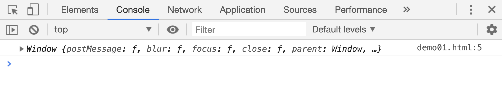
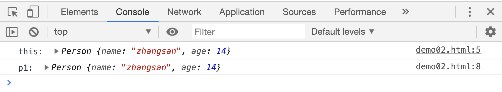
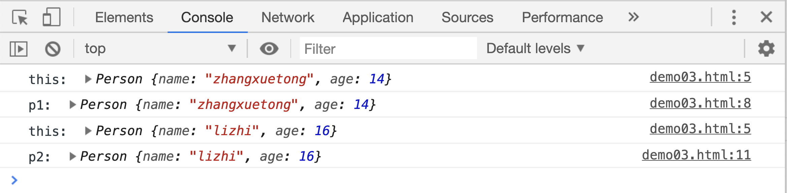
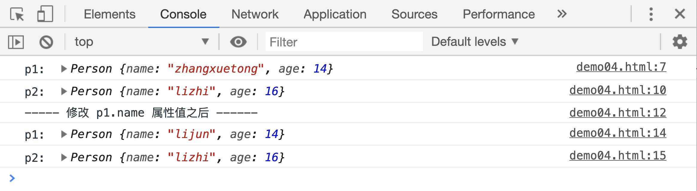

# 构造函数

先来看一个例子，假设要统计班级所有同学的名字，并且都用一个变量表示，需要怎么写：

```js
var p1 = {
    name: "lijun",
    age: 14,
};
var p2 = {
    name: "zhangxuetong",
    age: 14,
};
var p3 = {
    name: "liumeichao",
    age: 14,
};
// ......
```

这样写是不是太麻烦的，里面出现了太多的重复代码。JS 提供了一种特殊的函数，用来解决这个问题： 构造函数

先来看一下构造函数的声明方式和用法

```js
// 定义一个构造函数
function Person() {
    this.name = "zhangxuetong";
    this.age = 14;
    console.log(this);
}

// 通过关键字new生成Person函数的一个实例对象
var p1 = new Person();
```

1. 首先，构造函数的函数名通常会以<u>大写字母</u>开头，
2. 使用构造函数必须使用关键字`new`。
3. 构造函数中的 this 指向生成的实例对象本身

这里说一下构造函数中的 this，前面讲过函数中 this 的指向，会在函数被调用的时候确定下来。前面这段代码中：

当函数单独调用时(不推荐),函数内的 this 依然指向 window。

```html
<script>
    function Person() {
        this.name = "zhangsan";
        this.age = 14;
        console.log(this);
    }
    Person();
</script>
```

[案例源码](./demo/demo01.html)



通过关键字`new`调用的时候，this 指向的是调用后的返回值，也就是对象实例本身：

```html
<script>
    function Person() {
        this.name = "zhangsan";
        this.age = 14;
        console.log("this: ", this);
    }
    var p1 = new Person();
    console.log("p1: ", p1);
</script>
```

[案例源码](./demo/demo02.html)



## 构造函数的参数

构造函数和普通函数一样，可以在调用的时候，传入参数，比如：

```html
<script>
    function Person(name, age) {
        this.name = name;
        this.age = age;
        console.log("this: ", this);
    }
    var p1 = new Person("zhangxuetong", 14);
    console.log("p1: ", p1);

    var p2 = new Person("lizhi", 16);
    console.log("p2: ", p2);
</script>
```

[案例源码](./demo/demo03.html)



现在通过构造函数去统计班级所有学生的姓名和年龄，是不是比之前容易多了，只需要调用一个构造函数，给函数传入学生的姓名和年龄就可以了。

再来想一想，之前讲过的创建字符串、对象、数组的时候，有一种方法也是通过`new`来创建的。这些`new String() / new Object() / new Array()`中的`String Object Array`其实也是一种构造函数，并且是 JS 引擎提供的一种内置构造函数。

前面“原始类型和引用类型的区别”一文中说过，使用同一个引用地址的普通对象之间是相互影响的：

```js
var p1 = { name: "zhangXueTong", age: 14 };
var p2 = p1;

p2.name = "liZhi";
console.log(p1.name); // 'lizhi'
```

而调用构造函数生成的实例对象之间就不会发生这种情况，生成的每个对象之间是相互独立的：

```html
<script>
    function Person(name, age) {
        this.name = name;
        this.age = age;
    }
    var p1 = new Person("zhangxuetong", 14);
    console.log("p1: ", p1);

    var p2 = new Person("lizhi", 16);
    console.log("p2: ", p2);

    console.log("----- 修改 p1.name 属性值之后 ------");
    p1.name = "lijun";
    console.log("p1: ", p1);
    console.log("p2: ", p2);
</script>
```

[案例源码](./demo/demo04.html)


