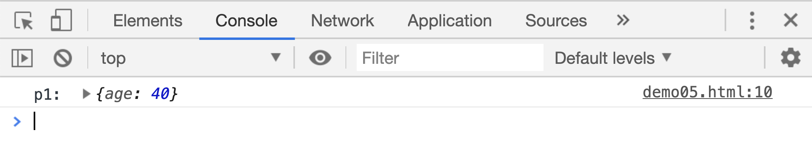
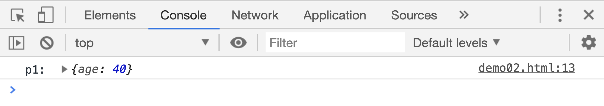
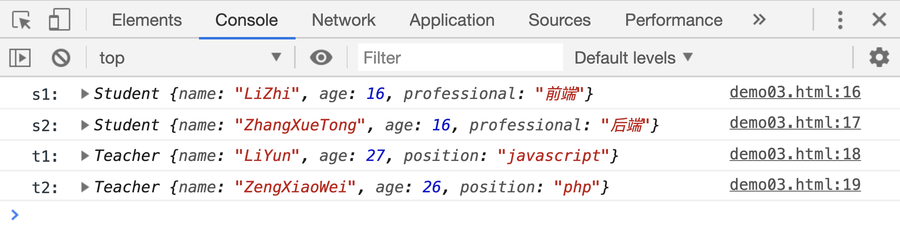
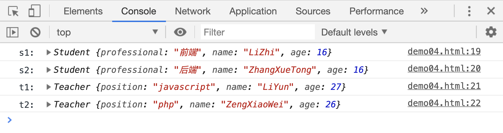
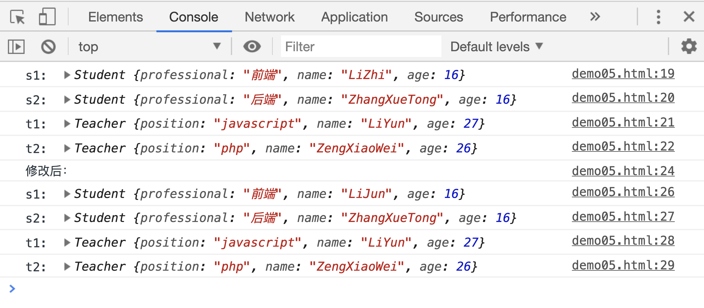
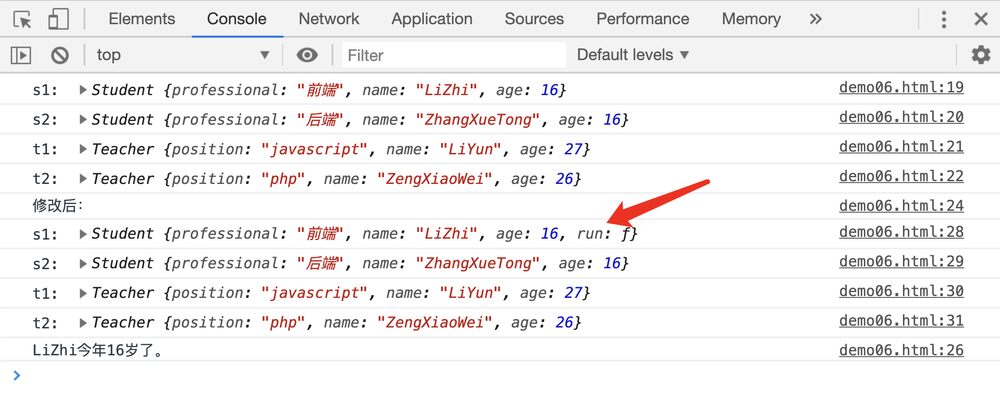

# 函数的继承

先来回忆一个关于`call()`的案例：

```html
<script>
var age = 30;
var p1 = {
age: 20,
};
function add() {
this.age = 40;
}
add.call(p1);
console.log("p1: ", p1);
</script>
```

[案例源码](./demo/demo01.html)



在案例中，通过`add.call(p1)`执行了`add`函数，且把函数内`this`指向修改为`p1`，通过`this.age = 40`成功把`p1`的`age`属性值修改为 `40`。

现在我们把代码改一下，增加一个函数：

```html
<script>
var age = 30;
var p1 = {
age: 20,
};
function add() {
this.age = 40;
// 这里的this其实还是指向了p1
}
function foo() {
// 把函数add中的this指向改为foo函数中的this，其实还是p1
add.call(this);
}
foo.call(p1); // 把foo函数中的this指向改为p1对象
console.log("p1: ", p1);
</script>
```

[案例源码](./demo/demo02.html)



ok，现在有这么一个需求：要求统计学校老师和学生信息，老师需要收集`名字 年龄和职位`信息，学生需要收集`名字 年龄和专业`信息。先看一下使用普通对象的方法：

```js
var s1 = {
age: 16,
name: "LiZhi",
professional: "前端",
};
var s2 = {
age: 16,
name: "ZhangXueTong",
professional: "后端",
};
var t1 = {
age: 27,
name: "LiYun",
position: "javascript",
};
var t2 = {
age: 26,
name: "ZengXiaoWei",
position: "php",
};
```

这才 2 个学生，2 个老师，如果要统计 10 个学生，10 个老师的话，代码量只是想想就可怕，而且重复代码有很多，现在再用前面讲过的构造函数实现以下：

```html
<script>
function Student(name, age, professional) {
this.name = name;
this.age = age;
this.professional = professional;
}
function Teacher(name, age, position) {
this.name = name;
this.age = age;
this.position = position;
}
var s1 = new Student("LiZhi", 16, "前端");
var s2 = new Student("ZhangXueTong", 16, "后端");
var t1 = new Teacher("LiYun", 27, "javascript");
var t2 = new Teacher("ZengXiaoWei", 26, "php");
console.log("s1: ", s1);
console.log("s2: ", s2);
console.log("t1: ", t1);
console.log("t2: ", t2);
</script>
```

[案例源码](./demo/demo03.html)



这样写完全没有问题，比用普通对象去收集的效率已经提高很多了，但是这个效率还可以提升，因为老师和学生有两个相同的属性：姓名和年龄。我们可以把这两个属性单独提取出来，代码如下：

```html
<script>
function Person(name, age) {
this.name = name;
this.age = age;
}
function Student(name, age, professional) {
this.professional = professional;
Person.call(this, name, age);
// 通过call调用Person函数，达到修改实例对象的目的
}
function Teacher(name, age, position) {
this.position = position;
Person.call(this, name, age);
}
var s1 = new Student("LiZhi", 16, "前端");
var s2 = new Student("ZhangXueTong", 16, "后端");
var t1 = new Teacher("LiYun", 27, "javascript");
var t2 = new Teacher("ZengXiaoWei", 26, "php");

console.log("s1: ", s1);
console.log("s2: ", s2);
console.log("t1: ", t1);
console.log("t2: ", t2);
</script>
```

[案例源码](./demo/demo04.html)



现在可以看到，这种方法生成的实例对象和前面的结果是相同的。

在这个案例中，通过`new Student()`调用`Student`函数，生成一个实例对象`s1`，`Student`函数执行的过程中，通过`Person.call(this,name,age)`调用了`Person`函数，并且把`name`和`age`作为参数传递给了`Person`函数把`Person`函数中的`this`指向了`Student`中的`this`，而`Student`中的`this`指的是实例对象`s1`，因此`Person`函数执中的 `this` 实际上也表示实例对象`s1`。函数中的`this.name = name`实际上相当于`s1.name = name`。

这个时候，我们可说**函数 Student 和函数 Teacher 继承了构造函数 Person 中的属性和方法**。并且此时生成的所有实例对象之间是互不影响的：

```html
<script>
function Person(name, age) {
this.name = name;
this.age = age;
}
function Student(name, age, professional) {
this.professional = professional;
Person.call(this, name, age);
}
function Teacher(name, age, position) {
this.position = position;
Person.call(this, name, age);
}
var s1 = new Student("LiZhi", 16, "前端");
var s2 = new Student("ZhangXueTong", 16, "后端");
var t1 = new Teacher("LiYun", 27, "javascript");
var t2 = new Teacher("ZengXiaoWei", 26, "php");

console.log("s1: ", s1);
console.log("s2: ", s2);
console.log("t1: ", t1);
console.log("t2: ", t2);

console.log("修改后：");
s1.name = "LiJun";
console.log("s1: ", s1);
console.log("s2: ", s2);
console.log("t1: ", t1);
console.log("t2: ", t2);
</script>
```

[案例源码](./demo/demo05.html)



如果给其中任意一个实例对象新增或者删除一个属性，也不会影响其他实例对象：

```html
<script>
function Person(name, age) {
this.name = name;
this.age = age;
}
function Student(name, age, professional) {
this.professional = professional;
Person.call(this, name, age);
}
function Teacher(name, age, position) {
this.position = position;
Person.call(this, name, age);
}
var s1 = new Student("LiZhi", 16, "前端");
var s2 = new Student("ZhangXueTong", 16, "后端");
var t1 = new Teacher("LiYun", 27, "javascript");
var t2 = new Teacher("ZengXiaoWei", 26, "php");

console.log("s1: ", s1);
console.log("s2: ", s2);
console.log("t1: ", t1);
console.log("t2: ", t2);

console.log("修改后：");
s1.run = function() {
console.log(this.name + "今年" + age + "岁了。");
};
console.log("s1: ", s1);
console.log("s2: ", s2);
console.log("t1: ", t1);
console.log("t2: ", t2);

s1.run();
</script>
```

[案例源码](./demo/demo06.html)


