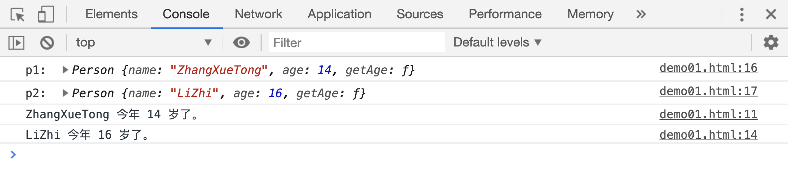
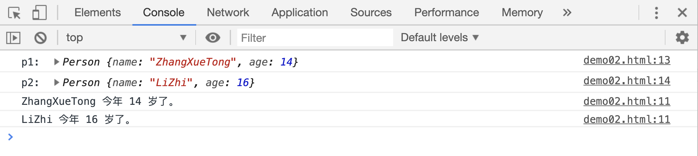
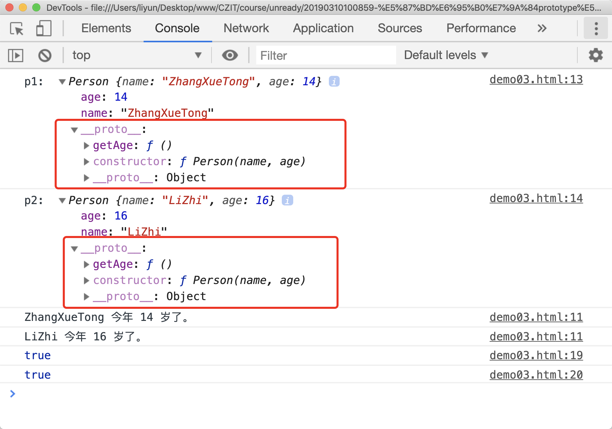
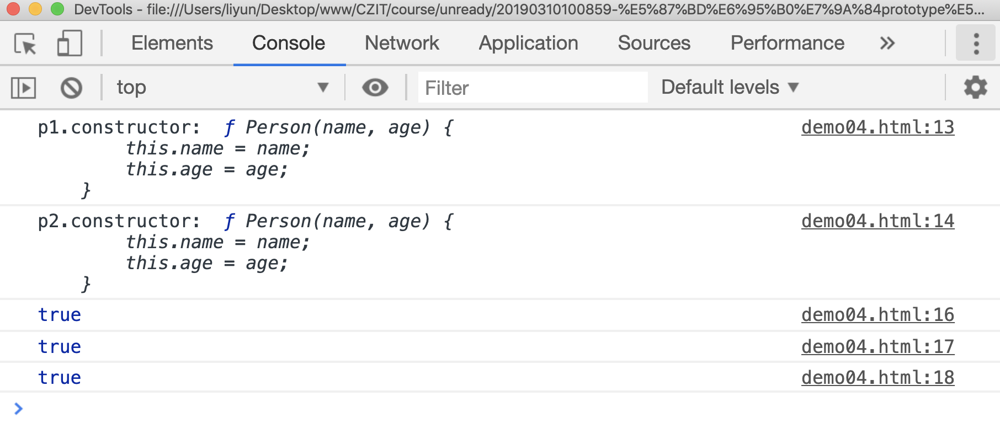

# 函数的 prototype 属性

前面讲到可以通过构造函数，方便的采集班级每一位同学的信息：

```js
function Person(name, age) {
this.name = name;
this.age = age;
}
var p1 = new Person("zhangxuetong", 14);

var p2 = new Person("lizhi", 16);
```

现在我想给每一位同学都新增一个函数属性，通过这个函数输出这么一句话'XX 同学，今年 XX 岁了。'：

```html
<script>
function Person(name, age) {
this.name = name;
this.age = age;
}
var p1 = new Person("ZhangXueTong", 14);

var p2 = new Person("LiZhi", 16);

p1.getAge = function() {
console.log(this.name + " 今年 " + this.age + " 岁了。");
};
p2.getAge = function() {
console.log(this.name + " 今年 " + this.age + " 岁了。");
};
console.log("p1: ", p1);
console.log("p2: ", p2);

p1.getAge();
p2.getAge();
</script>
```

[案例源码](./demo/demo01.html)



这样去写虽然功能也可以实现，但是效率太低了，这个时候可以借助函数的`prototype`属性来实现了：

```html
<script>
function Person(name, age) {
this.name = name;
this.age = age;
}
var p1 = new Person("ZhangXueTong", 14);

var p2 = new Person("LiZhi", 16);

Person.prototype.getAge = function() {
console.log(this.name + " 今年 " + this.age + " 岁了。");
};
console.log("p1: ", p1);
console.log("p2: ", p2);

p1.getAge();
p2.getAge();
</script>
```

[案例源码](./demo/demo02.html)



每个函数都有`prototype`属性，它表示函数的**原型**，这个原型也是一个“对象”，通过构造函数生成的实例对象，会自动继承构造函数的原型上的属性和方法。

这个原型对象在哪里找呢？实例对象中有一个属性`__proto__`，它的属性值和`函数.prototype`一样，可以获取到函数的原型对象：

```html
<script>
function Person(name, age) {
this.name = name;
this.age = age;
}
var p1 = new Person("ZhangXueTong", 14);

var p2 = new Person("LiZhi", 16);

Person.prototype.getAge = function() {
console.log(this.name + " 今年 " + this.age + " 岁了。");
};
console.log("p1: ", p1);
console.log("p2: ", p2);

p1.getAge();
p2.getAge();

console.log(p1.__proto__ === Person.prototype);
console.log(p2.__proto__ === Person.prototype);
</script>
```

[案例源码](./demo/demo03.html)



前面说 JS 在执行的过程中，会创建一条**作用域链**，用来向上查找变量或函数声明。构造函数生成的实例对象和构造函数的原型之间也有这么一条“链”，被称作**原型链**。它的目的是：**当实例对象使用一个本身不存在的属性或调用一个本身不存在的方法时，会沿着原型链想上查找**。也就是说生成的实例对象**继承了**构造函数原型对象中的属性或方法。

## 原型对象的 constructor 属性

上一张图片中，`p1`和`p2`的原型对象里面，都有一个`constructor`属性，并且属性值都是`Person函数`，表示**通过`函数.prototype`可以获取到构造函数的原型对象，通过`原型对象.constructor`属性，可以获取到这个原型对象所对应的构造函数**。

那么既然`constructor`属性出现在构造函数的原型对象中，也说明可以通过构造函数的实例对象访问`constructor`属性，通过这个属性，可以查到实例对象的构造函数。并且**同一个构造函数生成的实例对象，它们的 constructor 属性值是相同的，都指向构造函数本身**

```html
<script>
function Person(name, age) {
this.name = name;
this.age = age;
}
var p1 = new Person("ZhangXueTong", 14);

var p2 = new Person("LiZhi", 16);

Person.prototype.getAge = function() {
console.log(this.name + " 今年 " + this.age + " 岁了。");
};
console.log("p1.constructor: ", p1.constructor);
console.log("p2.constructor: ", p2.constructor);

console.log(p1.constructor === p2.constructor);
console.log(Person === p1.constructor);
console.log(Person === p2.constructor);
</script>
```

[案例源码](./demo/demo04.html)


