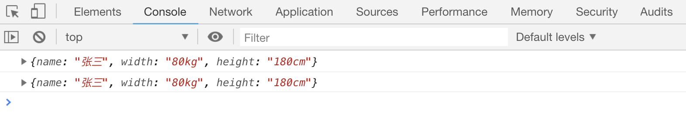
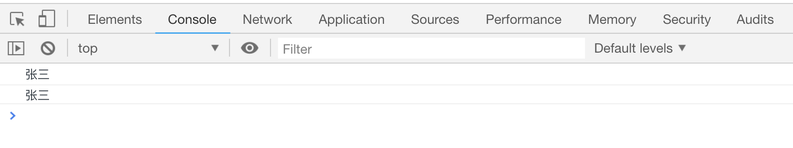
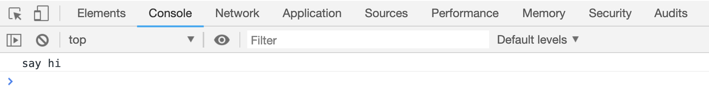
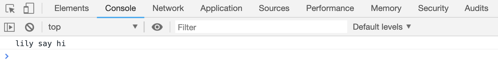
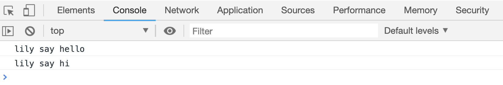

# 对象的创建和使用

对象可以看做是同时保存了多个属性的盒子，所有的属性使用`{}`包括起来，且属性和属性值分别以`key:value`的形式保存。比如

```js
var person1 = {
name: '张三'
width: '80kg',
height: '180cm',
}
```

这种创建对象的方式，叫做“对象字面量”

## 给对象添加属性

也可以先赋值一个空对象，再往里面添加数据，添加方式有两种:

- 使用`.`运算符：

```js
// 方法1
var person1 = {};
person1.name = "张三";
person1.width = "80kg";
person1.height = "180cm";
console.log(person1);
```

- 使用`[]`运算符

```js
// 方法2
var person2 = {};
person2["name"] = "张三";
person2["width"] = "80kg";
person2["height"] = "180cm";
console.log(person2);
```

[案例代码](./demo/demo01.html)



以上两种方式声明的变量结果是相同的

## 获取对象某个属性的值

同样的，如果想获取对象中某个属性的值，也有两种方式：

```js
var person1 = {
name: "张三",
width: "80kg",
height: "180cm",
};
// 第一种方式：
console.log(person1.name); // '张三'
// 第二种方式：
console.log(person1["name"]); // '张三'
```

[案例代码](./demo/demo02.html)



## 对象中使用函数

对象中的属性值可以是一个任何数据类型，函数也可以作为对象中的属性值

```html
<script>
var person = {
sayHi: function() {
console.log("say hi");
},
};
person.sayHi();
</script>
```

[案例代码](./demo/demo03.html)



上面案例中使用`person.saiHi()`调用 `person` 的 `sayHi` 属性.

> 对象中使用函数作为值的属性，通常被称为“对象的某种方法”。

## 对象的方法中使用 this

对象的方法中可以使用 this 关键字代替对象本身，便于获取对象其他的属性值

```html
<script>
var person = {
name: "lily",
sayHi: function() {
console.log(this.name + " say hi");
},
};
person.sayHi();
</script>
```

[案例代码](./demo/demo04.html)



上面案例中的`this`代替了对象`person`本身，因此可以获取到对象中的`name`属性值。再来看一个复杂的：

```html
<script>
var person = {
name: "lily",
sayHi: function() {
console.log(this.name + " say hi");
},
sayHello: function() {
console.log(this.name + " say hello");
this.sayHi();
},
};
person.sayHello();
</script>
```

[案例代码](./demo/demo05.html)



上面案例中，调用了`person.sayHello()`方法，`sayHello` 方法中又通过 `this` 调用了 `sayHi` 方法。
