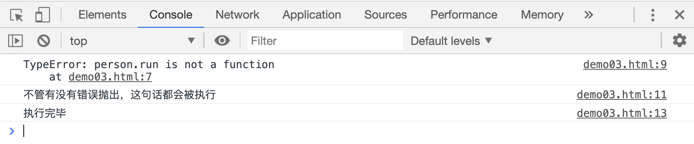

## 处理 JS 中错误

如果在代码中出现了语法错误，JS 引擎会往控制台抛出一个错误信息，并停止运行。比如：

```html
<script>
var person = {
age: 19,
};

person.run();
console.log("执行完毕");
</script>
```

[案例源码](./demo/dem01.html)


这个案例中最后一句`console.log("执行完毕")`没有执行，因为 JS 抛出了一个错误，停止执行了。

使用`try...catch(e)...`语句就可以拦截 JS 抛出的错误：

```html
<script>
var person = {
age: 19,
};

try {
person.run();
} catch (e) {
console.log(e);
}
console.log("执行完毕");
</script>
```

[案例源码](./demo/dem02.html)


这个案例中`console.log("执行完毕");`语句成功执行了，说明 JS 抛出的错误被`try...catch...`语句拦截了，`catch(e)`中的参数`e`表示 JS 抛出的错误内容，并且被我们的`console.log(e)`语句打印到控制台中了。

`try`中的语句如果出现一个错误，`try`中的语句将会停止执行，开始执行`catch`中的语句。

实际上和`try...catch...`配合使用的还有一个`finally...`，不管`try`语句中是否有错误抛出，`finally`中的语句，都会被执行，比如：

```html
<script>
var person = {
age: 19,
};

try {
person.run();
} catch (e) {
console.log(e);
} finally {
console.log("不管有没有错误抛出，这句话都会被执行");
}
console.log("执行完毕");
</script>
```

[案例源码](./demo/demo03.html)



## Error 对象

在 JS 中使用`new Error()`的格式可以自定义一个错误，并且通过`throw`语句把该错误抛出给浏览器，此时浏览器就会停止运行 JS 代码。

比如在函数执行的时候，我们去判断参数的类型：

```html
<meta charset="utf-8" />
<script>
function add(x) {
if (isNaN(x)) {
throw new Error("params x must is a number");
}
console.log(Math.floor(x));
}
add("abc");
</script>
```

[案例源码](./demo/dem04.html)


这种操作在写一个给别人用的函数时特别有用，如果他人在调用函数时，不知道应该传递什么类型的参数，我们可以通过这个方式停止执行 JS，并把错误信息输出到浏览器的控制台中，提醒其他的开发人员去修改。
