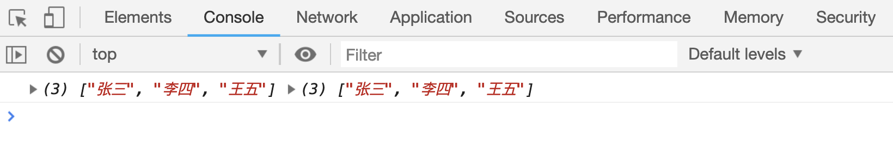
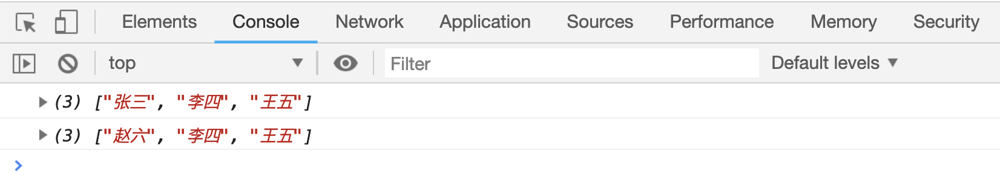
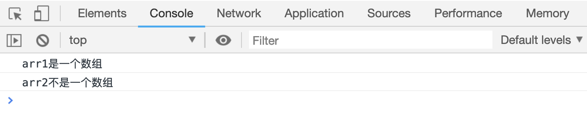
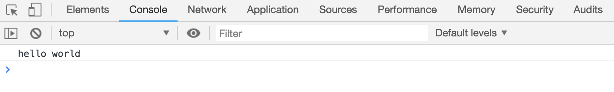

# 数组的声明和使用

数组可以用来存放多个数据，定义数组的方式有以下两种：

```js
// 方法一：
var arr1 = []; // 声明一个空数组
var arr2 = ["张三", "李四", "王五"];
```

这种方式，叫做“数组字面量”

```js
// 方法二：
var arr3 = new Array(); // 声明一个空数组
var arr4 = new Array("张三", "李四", "王五");
```

这两种方式最终的结果是一样的。

```html
<script>
    var arr1 = ["张三", "李四", "王五"];
    var arr2 = new Array("张三", "李四", "王五");
    console.log(arr1, arr2);
</script>
```

[案例代码](./demo/demo01.html)



## 给数组添加元素/修改元素内容

数组中的每个元素都有对应的索引值，索引值从 0 开始。可以通过这索引值，给数组添加元素或则是修改元素的内容

```html
<script>
    var arr = [];
    // 添加元素：
    arr[0] = "张三";
    arr[1] = "李四";
    arr[2] = "王五";
    cosole.log(arr);

    // 修改元素内容：
    arr[0] = "赵六";
    cosole.log(arr);
</script>
```

[案例代码](./demo/demo02.html)



## 多维数组

```js
var arr1 = [[1, 2, 3], [4, 5, 6]]; // 二维数组
var arr2 = [[[1, 2, 3], [4, 5, 6]], [[1, 2, 3], [4, 5, 6]]]; //三维数组
```

像上面这种元素仍然是数组的数组，被称为“多维数组”。

## 判断目标是不是数组

`Array.isArray()`方法用来判断括号内的参数是否是一个数组。

该方法返回一个布尔值，`false` 表示参数不是一个数组。

```html
<script>
    var arr1 = [];
    var arr2 = {};
    if (Array.isArray(arr1)) {
        console.log("arr1是一个数组");
    } else {
        console.log("arr1不是一个数组");
    }
    if (Array.isArray(arr2)) {
        console.log("arr2是一个数组");
    } else {
        console.log("arr2不是一个数组");
    }
</script>
```

[案例代码](./demo/demo03.html)



## 在数组中使用函数

```html
<script>
    var arr = [
        10,
        function() {
            console.log("hello world");
        },
    ];
    arr[1]();
</script>
```

[案例代码](./demo/demo04.html)


