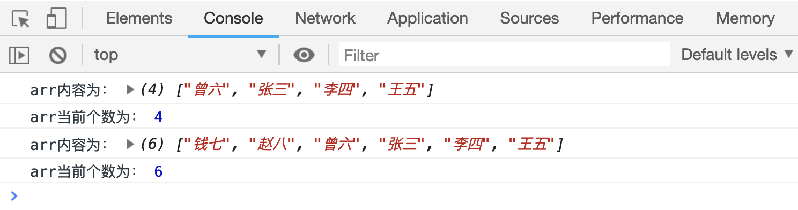

# 新增或删除数组中的元素

JS 内置了一些方法，用于往数组中添加元素，或者删除数组中指定位置的元素。

## 往数组结尾插入元素

`array.push(item1,item2, ...)`方法用来往数组的结尾插入多个新的元素；

该方法返回一个 `number` 值，表示当前数组的个数；

```html
<script>
    var arr = ["张三", "李四", "王五"];

    var a = arr.push("曾六");
    console.log("arr内容为：", arr);
    console.log("arr当前个数为：", a);

    var b = arr.push("钱七", "赵八");
    console.log("arr内容为：", arr);
    console.log("arr当前个数为：", b);
</script>
```

[案例代码](./demo/demo01.html)


## 往数组开头插入元素

`array.unshift(item1, item2, ...)`方法用来往数组的开头插入多个新的元素

该方法返回一个 `number` 值，表示`当前数组的个数`；

```html
<script>
    var arr = ["张三", "李四", "王五"];

    var a = arr.unshift("曾六");
    console.log("arr内容为：", arr);
    console.log("arr当前个数为：", a);

    var b = arr.unshift("钱七", "赵八");
    console.log("arr内容为：", arr);
    console.log("arr当前个数为：", b);
</script>
```

[案例代码](./demo/demo02.html)



## 删除数组开头和结尾的元素

```html
<script>
    var arr = ["张三", "李四", "王五", "曾六", "钱七", "赵八"];

    var a = arr.pop();
    console.log("arr的内容为： ", arr);
    console.log("被删除的元素是：", a);

    var b = arr.shift();
    console.log("arr的内容为： ", arr);
    console.log("被删除的元素是：", b);
</script>
```

[案例代码](./demo/demo03.html)


## splice 方法

`array.splice(index, length, item1, item2, ...)`方法可以自定义在数组中添加或者删除元素。

-   `index`表示要添加或者删除元素的起始位置
-   `length`表示要删除的元素个数
-   `item`表示想要添加的元素内容

该方法返回一个`数组`，数组中包含被删除的元素，如果`length`为 0，返回一个空数组。

```html
<script>
    var arr = ["苹果", "香蕉", "橘子", "西瓜"];
    console.log("splice之前：", arr);
    var a = arr.splice(1, 0, "葡萄");
    console.log("从下标为1 的位置开头删除0个元素，并插入1个新的元素：", arr, a);
    console.log("返回值为：", a);

    var b = arr.splice(1, 2);
    console.log("从下标为1 的位置开头删除2个元素，不插入新的元素：", arr);
    console.log("返回值为：", b);
</script>
```

[案例代码](./demo/demo04.html)


## 用`splice`分别实现`push unshift pop shift`的方法

```html
<script>
    var arr = ["苹果", "香蕉", "橘子", "西瓜"];
    console.log("arr的原有内容：", arr);
    // unshift
    arr.splice(0, 0, "葡萄");
    console.log("unshift:在开头位置插入一个新元素:", arr);

    // push
    arr.splice(arr.length, 0, "葡萄");
    console.log("push:在结束位置插入一个新元素:", arr);

    // shift
    arr.splice(0, 1);
    console.log("shift:删除第一个元素:", arr);

    // pop
    arr.splice(arr.length - 1, 1);
    console.log("pop:删除最后一个元素:", arr);
</script>
```

[案例代码](./demo/demo05.html)


