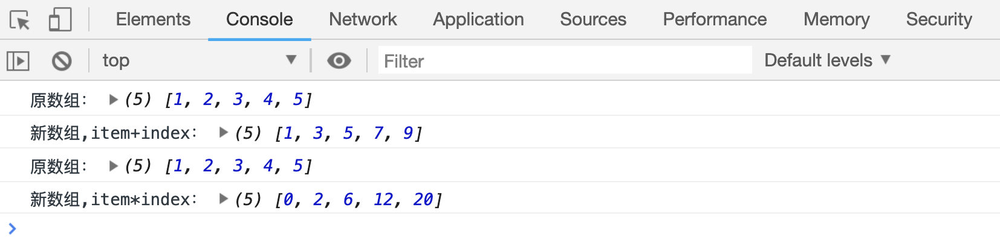
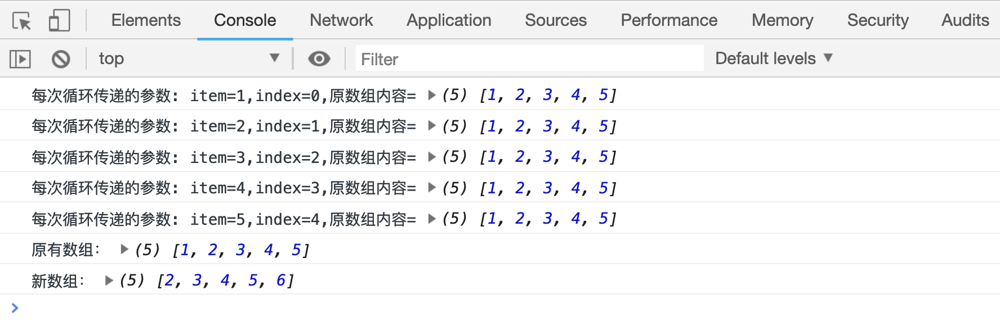

# 数组的 map 方法

先看一个需求：

> 要求实现一个函数，函数的参数为下面的`arr1`，函数最终返回一个新的数组，数组内容为`arr2`,且函数执行过程中，不能改变`arr1`的内容

```js
var arr1 = [1, 2, 3, 4, 5];
var arr2 = [2, 3, 4, 5, 6];
```

从需求中可以看出，`arr2`中的每个元素比对应的 `arr1` 中元素都多了 1，只需要在函数中循环`arr1`，让每个元素都`+1`即可得到`arr2`中的内容。

```html
<script>
    function change(arr) {
        console.log("原数组：", arr);
        var tmp = [];
        for (var m = 0; m < arr.length; m++) {
            var item = arr[m] + 1;
            tmp.push(item);
        }
        return tmp;
    }
    var arr1 = [1, 2, 3, 4, 5];
    var newArr1 = change(arr1);
    console.log("新数组：", newArr1);
</script>
```

[案例代码](./demo/demo01.html)


现在我们改一下需求：要求第一次调用的时候，让每个元素加 1，第二次调用的时候每个元素减 1.

既然每次调用的时候，对元素的处理方式不一样，我们就需要把这个处理方式独立出来，当做一个变量，在每次调用的时候，传入不同的处理方式：

```html
<script>
    function add(item) {
        return item + 1;
    }
    function change(arr, fn) {
        console.log("原数组：", arr);
        var tmp = [];
        for (var m = 0; m < arr.length; m++) {
            var item = fn(arr[m]);
            tmp.push(item);
        }
        return tmp;
    }
    var arr1 = [1, 2, 3, 4, 5];
    var newArr1 = change(arr1, function(currentValue) {
        return currentValue + 2;
    });
    console.log("新数组,currentValue + 1：", newArr1);

    var newArr2 = change(arr1, function(currentValue) {
        return currentValue - 1;
    });
    console.log("新数组,currentValue - 1：", newArr2);
</script>
```

[案例代码](./demo/demo02.html)


再来改一下需求：第一次调用的时候，每个元素加上各自的下标，第二次调用的时候，每个元素乘以各自的下标。

既然处理过程不同，就依然把处理过程的函数当做参数传递到函数中去。如果想要在处理过程中使用各自的下标，在调用“处理过程”的时候，把当前元素的下标作为参数，传递到“处理过程”中即可：

```html
<script>
    function add(item) {
        return item + 1;
    }
    function change(arr, fn) {
        console.log("原数组：", arr);
        var tmp = [];
        for (var m = 0; m < arr.length; m++) {
            var item = fn(arr[m], m);
            tmp.push(item);
        }
        return tmp;
    }
    var arr1 = [1, 2, 3, 4, 5];
    var newArr1 = change(arr1, function(currentValue, index) {
        return currentValue + index;
    });
    console.log("新数组,currentValue + index：", newArr1);

    var newArr2 = change(arr1, function(currentValue, index) {
        return currentValue * index;
    });
    console.log("新数组,currentValue * index：", newArr2);
</script>
```

[案例代码](./demo/demo03.html)



在来改一下需求：第一次调用的时候，元素加上原数组第 2 个元素，第二次调用的时候，元素加上原数组第 3 个元素。

前面函数中在循环的时候，已经把数组的当前元素值、当前元素下标，传递给了“处理过程函数”，现在需要使用数组的其他元素值，不妨把数组本身也传递进来：

```html
<script>
    function add(item) {
        return item + 1;
    }
    function change(arr, fn) {
        console.log("原数组：", arr);
        var tmp = [];
        for (var m = 0; m < arr.length; m++) {
            var item = fn(arr[m], m, arr);
            tmp.push(item);
        }
        return tmp;
    }
    var arr1 = [1, 2, 3, 4, 5];
    var newArr1 = change(arr1, function(currentValue, index, arr) {
        return currentValue + arr[1];
    });
    console.log("新数组,currentValue + arr[1]：", newArr1);

    var newArr2 = change(arr1, function(currentValue, index, arr) {
        return currentValue + arr[2];
    });
    console.log("新数组,currentValue + arr[2]：", newArr2);
</script>
```

[案例代码](./demo/demo04.html)


最后的案例中，我们定义了一个方法`change()`，该方法允许传递一个数组`arr`和一个函数`fn()`作为参数，数组`arr`中的每个元素通过`fn()`处理之后，重新组成一个新的数组，成为了`change()`函数的返回值。JS 中有一个内置的方法，用来实现同样分功能。

## map 方法

> `array.map(fn(currentValue, index, arr))`方法用来遍历`array`数组，每个元素经过函数`fn`函数处理之后，组合成一个新数组，作为函数的返回值

`fn(currentValue, index, arr)`中：

-   `currentValue`表示当前循环中的元素
-   `index`表示当前循环中元素的下标
-   `arr`表示原有数组

```html
<meta charset="utf-8" />
<script>
    var arr = [1, 2, 3, 4, 5];
    var newArr1 = arr.map(function(currentValue, index, arr) {
        console.log(
            "每次循环传递的参数: currentValue=" +
                currentValue +
                ",index=" +
                index +
                ",原数组内容=",
            arr,
        );
        return currentValue + 1;
    });
    console.log("原有数组：", arr);
    console.log("新数组：", newArr1);
</script>
```

[案例代码](./demo/demo05.html)



函数`fn`必须设置返回值，否则返回的新数组中所有元素均为`undefined`

```html
<meta charset="utf-8" />
<script>
    var arr = [1, 2, 3, 4, 5];
    var newArr1 = arr.map(function(currentValue, index, arr) {});
    console.log("原有数组：", arr);
    console.log("新数组：", newArr1);
</script>
```

[案例代码](./demo/demo06.html)


