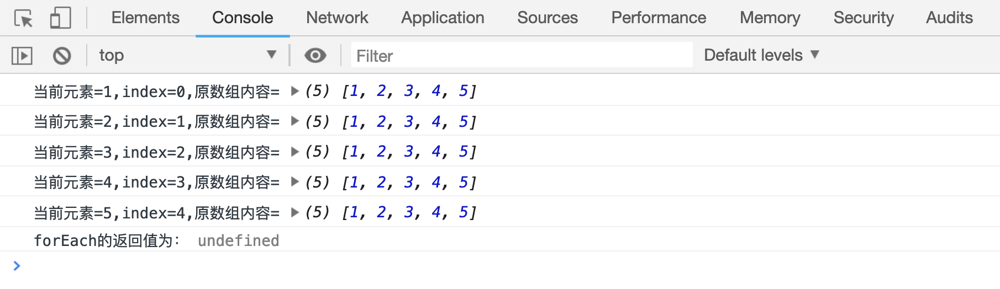

# 数组的 forEach 方法

`array.forEach(fn)`方法同样可以用来遍历数组，需要传递一个函数作为参数，用来处理数组中的每一个元素。

这个方法和`map`一样，默认会把当前遍历的元素内容、元素下标、原数组内容传递给`fn`作为参数。

该方法没有返回值(返回值为`undefined`)。

```html
<script>
    var arr = [1, 2, 3, 4, 5];
    var a = arr.forEach(function(item, index, arr) {
        console.log(
            "当前元素=" + item + ",index=" + index + ",原数组内容=",
            arr,
        );
    });
    console.log("forEach方法的返回值为：", a);
</script>
```

[案例代码](./demo/demo01.html)



再来看一个复杂的案例

```html
<script>
    var arr = [
        {
            name: "zhangsan",
            score: 70,
        },
        {
            name: "wanwu",
            score: 90,
        },
        {
            name: "lisi",
            score: 80,
        },
    ];
    arr.forEach(function(currentValue, index, arr) {
        document.write(
            "姓名：" +
                currentValue.name +
                "的分数是:" +
                currentValue.score +
                "<br/>",
        );
    });
</script>
```

[案例代码](./demo/demo02.html)


