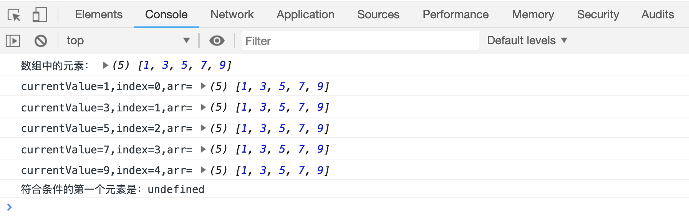
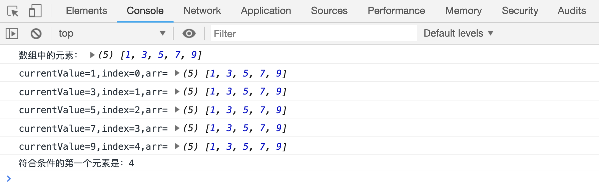
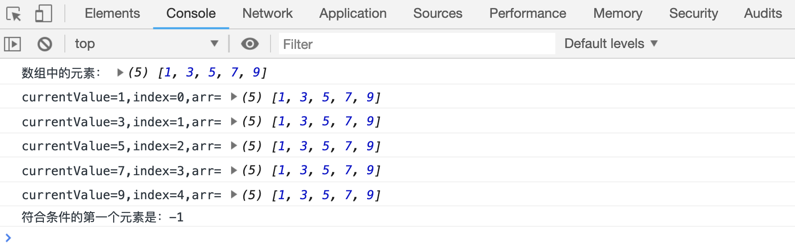

# 查找符合条件的第一个元素

`arr.find(fn(currentValue, index, arr))`方法用于在数组中查找符合条件的第一个元素

`find()`会遍历数组，发现符合条件的第一个元素后，停止循环，并返回该元素内容；如果没有符合条件的元素，返回`undefined`

`fn(currentValue, index, arr)`中：

-   `currentValue`表示当前循环中的元素
-   `index`表示当前循环中元素的下标
-   `arr`表示原有数组

```html
<script>
    var arr = [1, 3, 5, 7, 9];
    console.log("数组中的元素：", arr);
    var result = arr.find(function(currentValue, index, arr) {
        console.log(
            "currentValue=" + currentValue + ",index=" + index + ",arr=",
            arr,
        );
        return currentValue > 4;
    });
    console.log("符合条件的第一个元素是：" + result);
</script>
```

[案例代码](./demo/demo01.html)


```html
<script>
    var arr = [1, 3, 5, 7, 9];
    console.log("数组中的元素：", arr);
    var result = arr.find(function(currentValue, index, arr) {
        console.log(
            "currentValue=" + currentValue + ",index=" + index + ",arr=",
            arr,
        );
        return currentValue > 10;
    });
    console.log("符合条件的第一个元素是：" + result);
</script>
```

[案例代码](./demo/demo02.html)



## 返回符合条件的下标

`arr.findIndex(fn(currentValue, index, arr))`也是用来查找符合条件的元素，但该方法返回的是元素的下标，如果没有找到则返回-1

```html
<script>
    var arr = [1, 3, 5, 7, 9];
    console.log("数组中的元素：", arr);
    var result = arr.findIndex(function(currentValue, index, arr) {
        console.log(
            "currentValue=" + currentValue + ",index=" + index + ",arr=",
            arr,
        );
        return currentValue > 7;
    });
    console.log("符合条件的第一个元素是：" + result);
</script>
```

[案例代码](./demo/demo03.html)



再来看一个返回`-1`的案例：

```html
<script>
    var arr = [1, 3, 5, 7, 9];
    console.log("数组中的元素：", arr);
    var result = arr.findIndex(function(currentValue, index, arr) {
        console.log(
            "currentValue=" + currentValue + ",index=" + index + ",arr=",
            arr,
        );
        return currentValue > 10;
    });
    console.log("符合条件的第一个元素是：" + result);
</script>
```

[案例代码](./demo/demo04.html)


