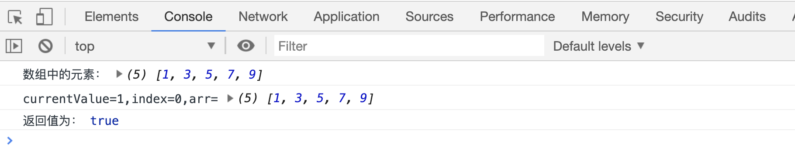

# 检查元素是否符合条件

## every 方法

`arr.every(fn(currentValue, index, arr))`用于遍历数组，当所有元素都符合条件，返回 `true`，只要有一个不符合条件，就会`终止循环`，返回 `false`

```html
<script>
    var arr = [1, 3, 5, 7, 9];
    console.log("数组中的元素：", arr);
    var result = arr.every(function(currentValue, index, arr) {
        console.log(
            "currentValue=" + currentValue + ",index=" + index + ",arr=",
            arr,
        );
        return currentValue > 0;
    });
    console.log("返回值为：", result);
</script>
```

[案例代码](./demo/demo01.html)


再看一个返回 false 的案例

```html
<script>
    var arr = [1, 3, 5, 7, 9];
    console.log("数组中的元素：", arr);
    var result = arr.every(function(currentValue, index, arr) {
        console.log(
            "currentValue=" + currentValue + ",index=" + index + ",arr=",
            arr,
        );
        return currentValue > 10;
    });
    console.log("返回值为：", result);
</script>
```

[案例代码](./demo/demo02.html)


## some 方法

`arr.some(function(){currentValue, index, arr})`方法也用来遍历数组，只要有一个元素符合条件，该方法就会返回`true`，并终止遍历；如果全部元素都不符合该条件，则返回`false`

```html
<script>
    var arr = [1, 3, 5, 7, 9];
    console.log("数组中的元素：", arr);
    var result = arr.some(function(currentValue, index, arr) {
        console.log(
            "currentValue=" + currentValue + ",index=" + index + ",arr=",
            arr,
        );
        return currentValue > 0;
    });
    console.log("返回值为：", result);
</script>
```

[案例代码](./demo/demo03.html)



再来看一个返回`false`的案例

```html
<script>
    var arr = [1, 3, 5, 7, 9];
    console.log("数组中的元素：", arr);
    var result = arr.some(function(currentValue, index, arr) {
        console.log(
            "currentValue=" + currentValue + ",index=" + index + ",arr=",
            arr,
        );
        return currentValue > 10;
    });
    console.log("返回值为：", result);
</script>
```

[案例代码](./demo/demo04.html)


