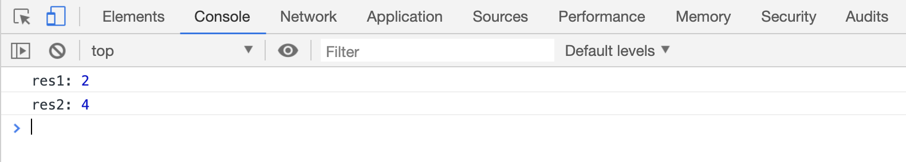
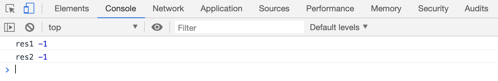

# indexOf 和 lastIndexOf 方法查找元素

`arr.indexOf(target)`方法用来在数组 `arr` 中`从左到右`查找第一个 `target` 元素，返回元素的下标，没找到返回-1

`arr.lastIndexOf(target)`方法用来在数组 `arr` 中`从右到左`查找第一个 `target` 元素，返回元素的下标，没找到返回-1

```html
<script>
    var arr = ["苹果", "香蕉", "西瓜", "橘子", "西瓜"];

    var res1 = arr.indexOf("西瓜");
    console.log("res1:", res1);

    var res2 = arr.lastIndexOf("西瓜");
    console.log("res2:", res2);
</script>
```

[案例代码](./demo/demo01.html)



`indexOf()`和`lastIndexOf()`在查找元素的时候，才用的是`===`运算，所以:

```html
<script>
    var arr = [1, 2, "3", 4, 5];

    var res1 = arr.indexOf("2");
    console.log("res1", res1);

    var res2 = arr.indexOf(3);
    console.log("res2", res2);
</script>
```

[案例代码](./demo/demo02.html)


