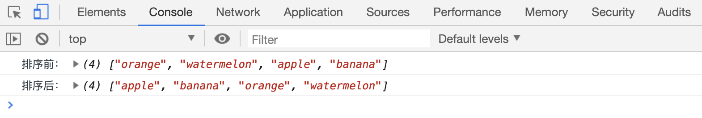
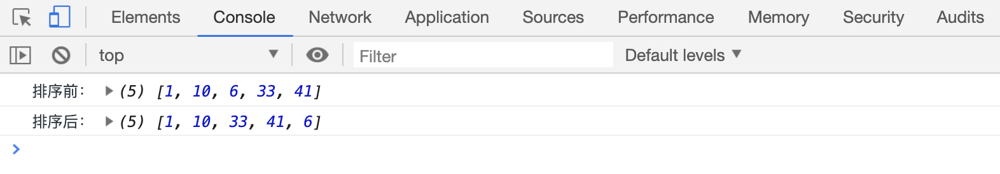
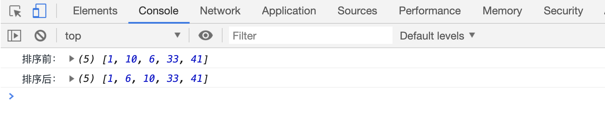
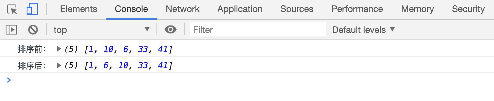
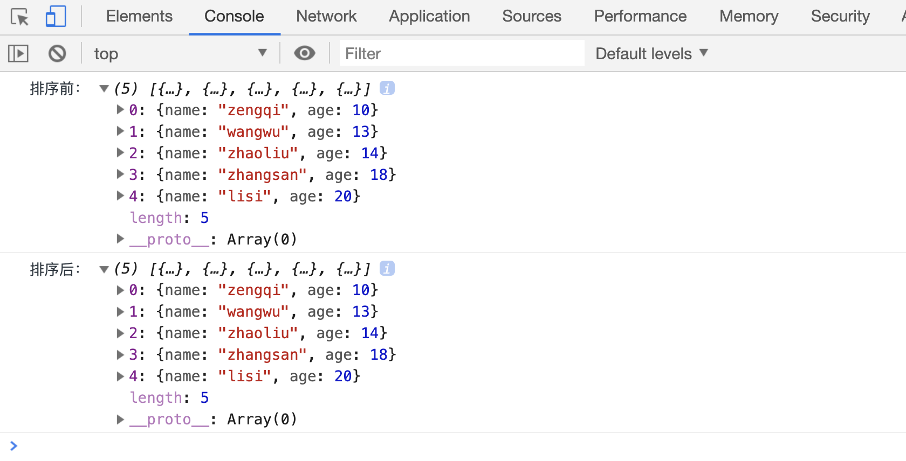

# sort 方法对数组排序

`arr.sort()`方法用来对数组中的元素重新排序，默认会把元素转为字符串，再根据字符串的 `Unicode`码点排序。

> 注意: 该方法会改变原有数组

```html
<script>
var arr = ["orange", "watermelon", "apple", "banana"];
console.log("排序前：", arr);
arr.sort();
console.log("排序后：", arr);
</script>
```

[案例代码](./demo/demo01.html)



但是这样的排序方法是有问题的，比如：

```html
<script>
var arr = [1, 10, 6, 33, 41];
console.log("排序前：", arr);
arr.sort();
console.log("排序后：", arr);
</script>
```

[案例代码](./demo/demo02.html)



我们想要的结果应该是这样的`[1,6,10,33,41]`，实际上排序后的 6 反而到了 41 的后面。这是因为 6 的 unicode 码大于 4 的 unicode 码。

那么怎么才能让排序结果按照预料的结果去执行呢？sort 方法可以传递一个参数进去，用来作为排序的条件：

`arr.sort([fn(a, b)])`会依次对数组相邻两个元素对比，`a`和`b`分别代表两个相邻的元素。

- 当`fn`函数返回值小于 0 时，`a`会被放在`b`的前面.
- 当`fn`函数返回值大于 0 时，`a`会被放在`b`的后面.
- 当`fn`函数返回值等于 0 时，`a`和`b`的位置不发生变化.

```html
<script>
var arr = [1, 10, 6, 33, 41];
console.log("排序前：", arr);
arr.sort(function(a, b) {
if (a < b) {
return -1;
}
if (a > b) {
return 1;
}
return 0;
});
console.log("排序后：", arr);
</script>
```

[案例代码](./demo/demo03.html)



还可以更简单的实现上面的目的：

```html
<script>
var arr = [1, 10, 6, 33, 41];
console.log("排序前：", arr);
arr.sort(function(a, b) {
return a - b;
});
console.log("排序后：", arr);
</script>
```

[案例代码](./demo/demo04.html)



再来看一个元素为对象的排序：

```html
<script>
var arr = [
{
name: "zhangsan",
age: 18,
},
{
name: "lisi",
age: 20,
},
{
name: "wangwu",
age: 13,
},
{
name: "zhaoliu",
age: 14,
},
{
name: "zengqi",
age: 10,
},
];
console.log("排序前：", arr);
arr.sort(function(a, b) {
return a.age - b.age;
});
console.log("排序后：", arr);
</script>
```

[案例代码](./demo/demo05.html)


