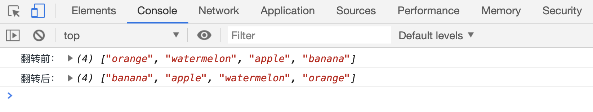

# reverse 方法翻转数组元素顺序

`arr.reverse()`方法用来对翻转数组中元素的顺序

```html
<script>
    var arr = ["orange", "watermelon", "apple", "banana"];
    console.log("翻转前：", arr);
    arr.reverse();
    console.log("翻转后：", arr);
</script>
```

[案例代码](./demo/demo01.html)


