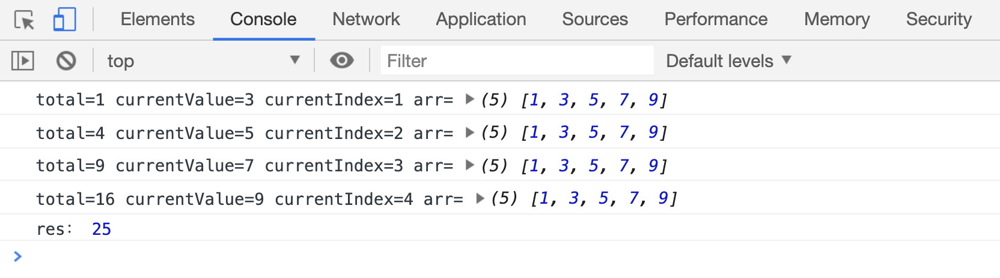
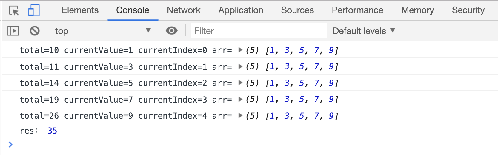
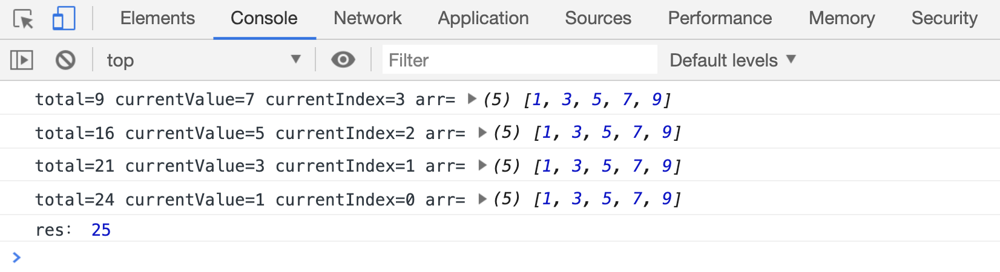
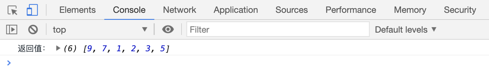
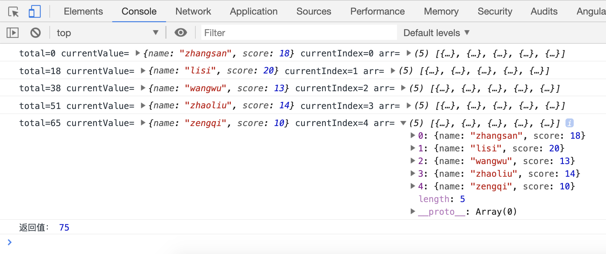

# reduce 和 reduceRight 统计元素

`arr.reduce(fn(totalValue, currentValue,currentIndex, arr),[initialValue])`会使用`fn`函数把数组中所有的元素都统计一遍。

- `initialValue` 可选参数，表示第一次调用 `fn` 函数时 `total` 的值，如果设置了该参数，第一次执行 `fn` 函数时 `total` 参数会使用这个值，如果没有设置，参数`total`会使用数组中第一个元素的值
- `total` 表示`fn`上一次执行后的返回值
- `currentValue` 表示当前正在处理的元素，如果设置了 `initialValue`，该值从第 1 个元素开始，如果没有设置，该值从第 2 个元素开始
- `currentIndex` 表示当前正在处理的元素下标，如果设置了`initialValue`，该值从`0`开始计算，如果没有设置，该值从`1`开始计算
- `arr` 表示原数组

先看看简单的用法：

```html
<script>
var arr = [1, 3, 5, 7, 9];
var res = arr.reduce(function(total, currentValue, currentIndex, arr) {
console.log(
"total=" + total,
"currentValue=" + currentValue,
"currentIndex=" + currentIndex,
"arr=",
arr,
);
return total + currentValue;
});
console.log("res：", res);
</script>
```

[案例代码](./demo/demo01.html)



上面案例中`reduce`函数执行之后，返回了所有元素的和。

下面我们试试传入一个初始值`initialValue`:

```html
<script>
var arr = [1, 3, 5, 7, 9];
var res = arr.reduce(function(total, currentValue, currentIndex, arr) {
console.log(
"total=" + total,
"currentValue=" + currentValue,
"currentIndex=" + currentIndex,
"arr=",
arr,
);
return total + currentValue;
}, 10);
console.log("res：", res);
</script>
```

[案例代码](./demo/demo02.html)



可以看出，设置了`initialValue`的`reduce`函数，很明显它的处理过程，比没有设置多了一次

## reduceRight

`arr.reduceRight(fn(totalValue, currentValue,currentIndex, arr),[initialValue])`方法与`reduce`不同之处在于：`reduce`是从左往右处理元素，`reduceRight`是从右往左处理元素。

```html
<script>
var arr = [1, 3, 5, 7, 9];
var res = arr.reduceRight(function(total, currentValue, currentIndex, arr) {
console.log(
"total=" + total,
"currentValue=" + currentValue,
"currentIndex=" + currentIndex,
"arr=",
arr,
);
return total + currentValue;
});
console.log("res：", res);
</script>
```

[案例代码](./demo/demo03.html)



## reduce 的实用性

使用 `reduce` 函数，我们可以方便的实现`元素去重`的功能；

```html
<script>
var arr = [1, 3, 5, 3, 9, 2, 1, 7, 9];
var res = arr.reduceRight(function(total, currentValue, currentIndex, arr) {
if (!total.includes(currentValue)) {
total.push(currentValue);
}
return total;
}, []);
console.log("res：", res);
</script>
```

[案例代码](./demo/demo04.html)



上面的案例中，先给第一次`fn`函数执行时的`total`传入一个初始值：`[]`；处理每个元素时，如果在`total`中没有找到该元素，则把元素放进`total`中去。最终就返回的是一个没有重复元素的数组。

但是我们知道数组中的元素不可能只是数字，万一数组的元素是对象形式呢？比如像统计以下学生的分数之和：

```html
<script>
var arr = [
{
name: "zhangsan",
score: 18,
},
{
name: "lisi",
score: 20,
},
{
name: "wangwu",
score: 13,
},
{
name: "zhaoliu",
score: 14,
},
{
name: "zengqi",
score: 10,
},
];
var res = arr.reduce(function(total, currentValue, currentIndex, arr) {
console.log(
"total=" + total,
"currentValue=",
currentValue,
"currentIndex=" + currentIndex,
"arr=",
arr,
);
return total + currentValue.score;
}, 0);
console.log("返回值：", res);
</script>
```

[案例代码](./demo/demo05.html)



> 在元素是对象的时候，最好给`initialValue`设置一个初始值
