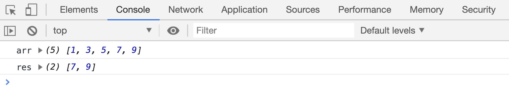
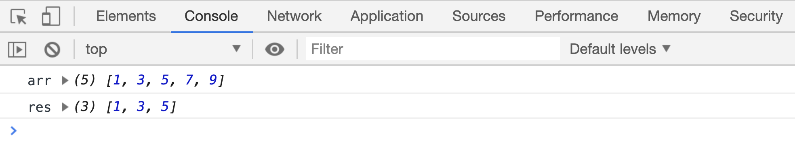
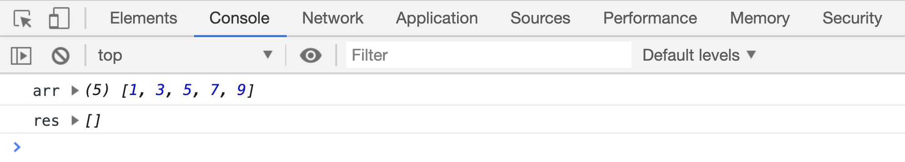

# 选取数组的一部分

`arr.slice(beginIndex [, endIndex])`方法用来选取数组的一部分内容。返回被选取的元素组成的新数组。

## 默认值

如果没有 `endIndex` 参数，返回的新数组会包含从 `beginIndex` 开始到结尾的所有元素

```html
<script>
    var arr = [1, 3, 5, 7, 9];
    var res = arr.slice(3);

    console.log("arr", arr);
    console.log("res", res);
</script>
```

[案例源码](./demo/demo02.html)



## 两个参数

如果传入了 2 个参数，返回的新数组中包含`beginIndex`位置的元素，不包含`endIndex`位置的元素。

```html
<script>
    var arr = [1, 3, 5, 7, 9];
    var res = arr.slice(2, 5);

    console.log("arr", arr);
    console.log("res", res);
</script>
```

[案例源码](./demo/demo03.html)



## 使用负值下标

选取部分元素时，参数可以使用负值，负值从数组最右边算起。

```html
<script>
    var arr = [1, 3, 5, 7, 9];
    var res = arr.slice(-5, -2);

    console.log("arr", arr);
    console.log("res", res);
</script>
```

[案例源码](./demo/demo04.html)


## 返回空数组的情况

`beginIndex`必须小于`endIndex`，否则会返回`空数组`。

```html
<script>
    var arr = [1, 3, 5, 7, 9];
    var res = arr.slice(-2, -5);

    console.log("arr", arr);
    console.log("res", res);
</script>
```

[案例源码](./demo/demo05.html)


