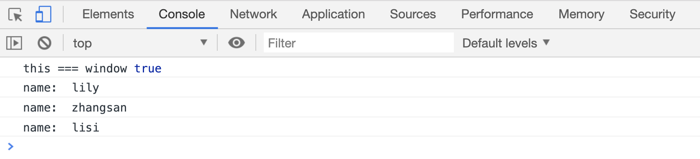
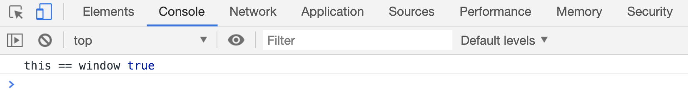
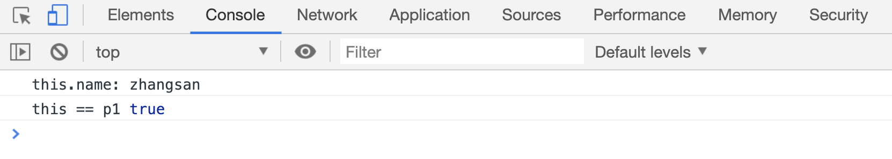
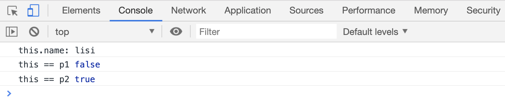
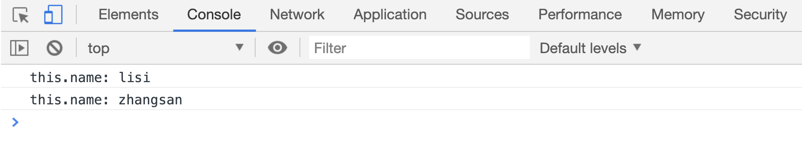
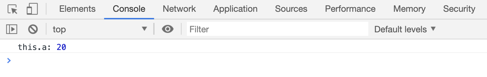
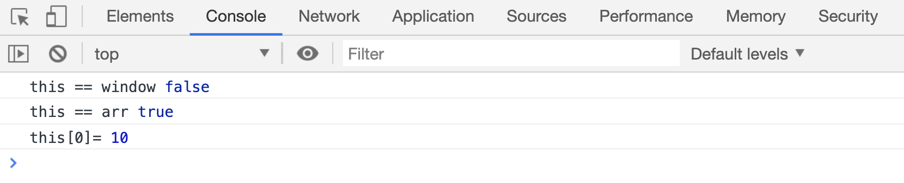

# 神奇的 this

JS 中有一个类似《X 战警》中变形女角色的存在`this`。它的值不是固定的，随时都在发生变化。

> 本文的所有案例都是在浏览器环境下执行的

## 函数外的 this

在函数外使用 `this` 时，`this`指向全局变量`window`，也就是说`var name = 'lily`和`window.name = 'lily'`以及`this.name = 'lily`的结果其实是相同的。

```html
<script>
    console.log("this === window", this === window);
    var name = "lily";
    console.log("name: ", name);

    window.name = "zhangsan";
    console.log("name: ", name);

    this.name = "lisi";
    console.log("name: ", name);
</script>
```

[代码案例](./demo/demo01.html)



## 函数内的 this

函数内的 this，要分为两种情况

-   直接调用函数
-   被其他对象调用

### 直接调用函数

直接调用函数时函数内的 `this` 指向 `window` 对象

```html
<script>
    function add() {
        console.log("this == window", this == window);
    }
    add();
</script>
```

[代码案例](./demo/demo02.html)



### 被其他对象调用

被其他对象调用时，函数内的`this`和调用函数的对象有关：

```html
<script>
    var p1 = {
        name: "zhangsan",
        run: function() {
            console.log("this.name:", this.name);
            console.log("this == p1", this === p1);
        },
    };
    p1.run();
</script>
```

[代码案例](./demo/demo03.html)



再看一个案例：

```html
<script>
    var p1 = {
        name: "zhangsan",
        run: function() {
            console.log("this.name:", this.name);
            console.log("this == p1", this === p1);
            console.log("this == p2", this === p2);
        },
    };
    var p2 = {
        name: "lisi",
        run: p1.run,
    };
    p2.run();
</script>
```

[代码案例](./demo/demo04.html)



在这个案例中，`p1.run`的值被重复赋值给`p2.run`属性。`p2`是`run()`方法的实际调用者，所以`run()`方法中的`this`指向的是`p2`

再来看一个：

```html
<script>
    var name = "zhangsan";
    var p1 = {
        name: "lisi",
        run: function(a) {
            console.log("this.name:", this.name);
        },
    };
    p1.run();

    var foo = p1.run;
    foo();
</script>
```

[代码案例](./demo/demo05.html)



上面这个案例中，第一次的`run`方法是被`p1`调用的，所以函数中的 this 指向了调用者`p1`;那么`p1.name`的值就是`lisi`;

第二次`run`的属性值被赋值给了一个单独的变量`foo`。`foo()`实际上是直接调用了函数，它没有调用者，所以`this`指向了`window`对象。`window.name`的值是`zhangsan`

再来一个：

```html
<script>
    function foo() {
        console.log("this.a", this.a);
    }

    function active(fn) {
        fn(); // 没有调用者
    }

    var a = 20;
    var obj = {
        a: 10,
        getA: foo,
    };

    active(obj.getA);
</script>
```

[代码案例](./demo/demo06.html)



这个案例中`foo`函数被赋值给了`obj.getA`属性，又被作为参数传递给`active`函数，在`active`中调用的时候，实际上还是直接执行的，没有调用者，所以函数中的`this`还是指向了`window`,所以`window.a`的值是`20`

## 数组中的函数

```html
<script>
    function foo() {}
    var arr = [
        10,
        function() {
            console.log("this == window", this == window);
            console.log("this == arr", this == arr);
            console.log("this[0]=", this[0]);
        },
    ];
    arr[1]();
</script>
```

[代码案例](./demo/demo07.html)



上面案例中，数组中的函数执行的时候，实际上是被数组调用的，也就是说数组是函数的实际调用者，所以函数中的`this`指向了调用者`arr`本身。
