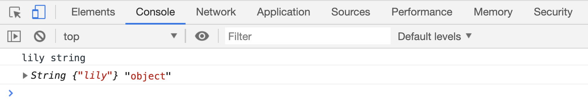
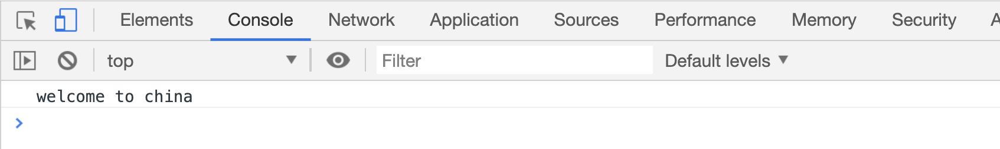
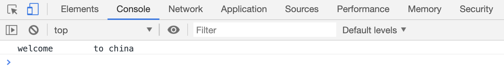
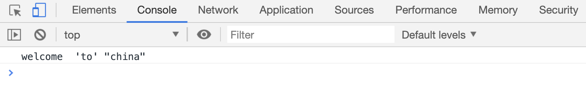

# 字符串

字符串指的是以文本形式保存的数据。在 JS 中字符串需要用单引号或者双引号包裹起来。

创建一个字符串有两种方式：

```html
<script>
// 基本字符串
var a = "lily";
console.log(a, typeof a);

// 字符串对象
var b = new String("lily");
console.log(b, typeof b);
</script>
```

[代码案例](./demo/demo01.html)



## 字符串拼接

字符串之间可以使用`+`拼接，比如：

```html
<script>
var str = "welcome " + "to" + " china";
console.log(str);
</script>
```

[代码案例](./demo/demo02.html)



也可以使用`\`拼接多行字符串：

> 注意：`\`后面不能有空格之外的任意字符，否则反斜杠不会生效; `\`下一行开头位置的所有空格、缩进，都会被真实插入到字符串中。

```html
<script>
var str =
"welcome\
to\
 china";
console.log(str);
</script>
```

[代码案例](./demo/demo03.html)



## 转义字符

字符串两端的单引号或者双引号，仅仅是表示该值是一个字符串类型。如果想在字符串中插入一些特殊字符时，可以在特殊字符前面加上转义符号`\`。

```html
<script>
var str = "welcome'to' \"china\"";
console.log(str);
</script>
```

> 上面案例中两端使用了双引号表示这是一个字符串值，字符串中使用单引号就不需要转义了，使用双引号必须使用转义才可以

[代码案例](./demo/demo04.html)



常用的需要转义的特殊字符：

| 转义字符 | 作用 |
| -------- | ------------ |
| `\0` | 空字符 |
| `\'` | 单引号 |
| `\"` | 双引号 |
| `\\` | 反斜杠 |
| `\n` | 换行 |
| `\r` | 回车 |
| `\uXXXX` | Unicode 码点 |
