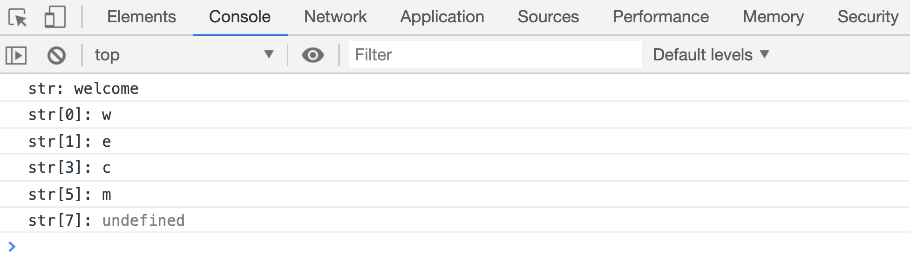

# 字符串的长度 length

`str.length`属性可以用来获取字符串的长度，也就是字符串中字符的个数。

```html
<script>
var str = "welcome";
console.log("str:", str);
console.log("str.length:", str.length);

str = "home";
console.log("str:", str);
console.log("str.length:", str.length);
</script>
```

## 使用下标获取字符

字符串也可以使用下标获取指定位置的字符，下标不在字符串长度范围内，会返回`undefined`

```html
<script>
var str = "welcome";
console.log("str:", str);
console.log("str[0]:", str[0]);
console.log("str[1]:", str[1]);
console.log("str[3]:", str[3]);
console.log("str[5]:", str[5]);
console.log("str[7]:", str[7]);
</script>
```

[代码案例](./demo/demo02.html)


