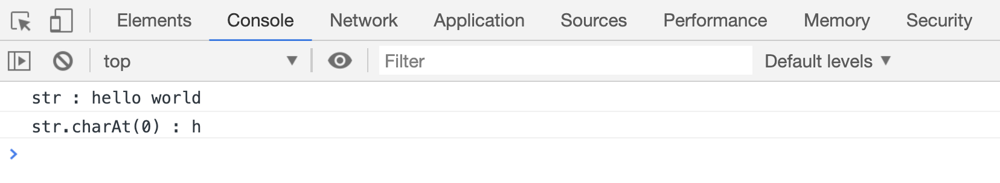
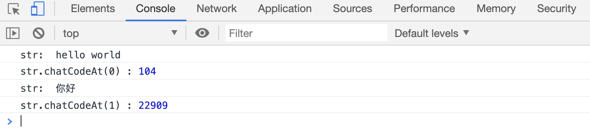
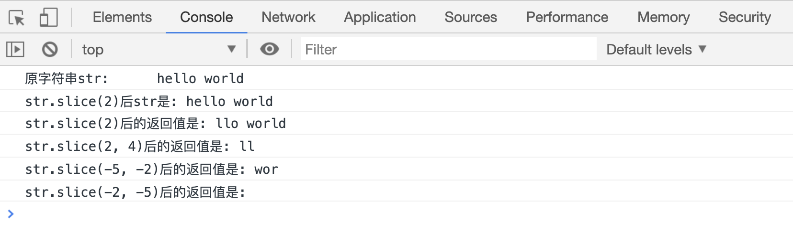
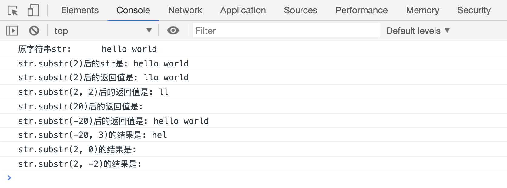

# 提取字符

`String` 对象提供了许多提取字符的方法。

## charAt()

`str.charAt(index)`方法可以返回指定位置的字符，不影响原有字符串

```html
<script>
var str = "hello world";
var res = str.charAt(0);
console.log(res);
</script>
```

[代码案例](./demo/demo01.html)



## charCodeAt()

`charCodeAt(index)`方法返回指定位置的字符串的十进制 unicode 码点

```html
<script>
var str = "hello world";
var res = str.charCodeAt(0);
console.log("str: ", str);
console.log("str.chatCodeAt(0) :", res);

str = "你好";
var res = str.charCodeAt(1);
console.log("str: ", str);
console.log("str.chatCodeAt(1) :", res);
</script>
```

[代码案例](./demo/demo02.html)



## slice()

`str.slice(beginIndex [, endIndex])`同样用于提取字符，返回被提取的字符组成的新字符串，不影响原有字符串。

- `beginIndex` 表示提取字符的起始位置，`endIndex` 表示提取自的结束位置
- 如果没有传递`endIndex`参数，返回的新字符串会包含从`beginIndex` 位置到结尾的所有元素
- 返回的字符串包含`beginIndex`下标的字符，不包含`endIndex`下标的字符
- `beginIndex`必须小于`endIndex`，否则会返回一个空字符串

```html
<script>
var str = "hello world";
console.log("原字符串str: ", str);

var res = str.slice(2);
console.log("str.slice(2)后str是:", res);
console.log("str.slice(2)后的返回值是:", res);

res = str.slice(2, 4);
console.log("str.slice(2, 4)后的返回值是:", res);

res = str.slice(-5, -2);
console.log("str.slice(-5, -2)后的返回值是:", res);

res = str.slice(-2, -5);
console.log("str.slice(-2, -5)后的返回值是:", res);
</script>
```

[代码案例](./demo/demo03.html)



## substr()

`str.substr(beginIndex [, length])`方法，同样可以用来提取字符串，返回被提取字符串组成的新字符串，不影响原有字符串。

- `beginIndex`表示开始提取字符串的位置索引值。如果`beginIndex`为正值，超过了字符串的长度，返回一个空字符串；如果`beginIndex`为负值，且该值的绝对值超过字符串的长度，则使用 0 作为开始提取的位置索引值
- `length`表示从`beginIndex`开始提取的字符个数。如果`length`值为 0 或者负值，返回一个空字符串

```html
<script>
var str = "hello world";
console.log("原字符串str: ", str);

// 默认返回从索引值为2开始到结尾的所有字符组成的新字符串
res = str.substr(2);
console.log("str.substr(2)的结果是:", res);

// 返回从索引值2开始，2个字符组成的新字符串
res = str.substr(2, 2);
console.log("str.substr(2, 2)的结果是:", res);

// 20大于字符串的长度，会返回一个空数组
res = str.substr(20);
console.log("str.substr(20)的结果是:", res);

// -20的绝对值大于富川长度，自动从0开始提取到结尾
res = str.substr(-20);
console.log("str.substr(-20)的结果是:", res);

// -20的绝对值大于字符串长度，自动从0开始提取3个字符
res = str.substr(-20, 3);
console.log("str.substr(-20, 3)的结果是:", res);

// 从索引值2的位置开始提取0个字符，返回空字符串
res = str.substr(2, 0);
console.log("str.substr(2, 0)的结果是:", res);

// length的值为负值，返回空字符串
res = str.substr(2, -2);
console.log("str.substr(2, -2)的结果是:", res);
</script>
```

[代码案例](./demo/demo04.html)



## substring()

`str.substring(beginIndex [, endIndex])`，通样是用来提取字符串中的字符，返回组成的新字符串。

`substring()`看起来和`slice()`用法相似，实际上有一个致命的区别：

- `slice()`传入负值时，表示从右向左的字符索引值
- `substring()`只要传入`非正数值`的参数，都会被当做 0
- 如果`substring()`中的`beginIndex`大于`endIndex`，该方法会自动把两个参数互调位置。

```html
<script>
var str = "hello world";
console.log("原字符串str: ", str);

var res = str.slice(2, -1);
console.log("str.slice(2, -1) 的返回值是：", res);

var res = str.substring(2, -1);
console.log("str.substring(2, -1) 的返回值是：", res);
</script>
```

> 上面的案例中：-1 小于 0，会被强制使用 0 替换；beginIndex 的值又大于 endIndex，因此实际上提取的字符串应该是索引值 0 到 2 之间的字符串。(substring 返回的字符串同样只包含 beginIndex 位置的字符，不包含 endIndex 位置的字符，0 和 2 交换位置后，返回的字符串中，就是只包含 0 位置的字符，包含 2 位置的字符)
