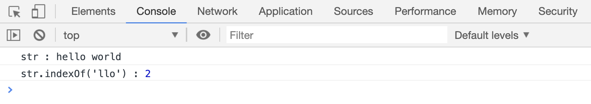
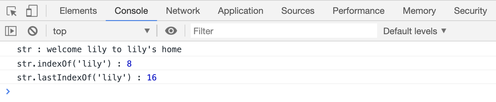
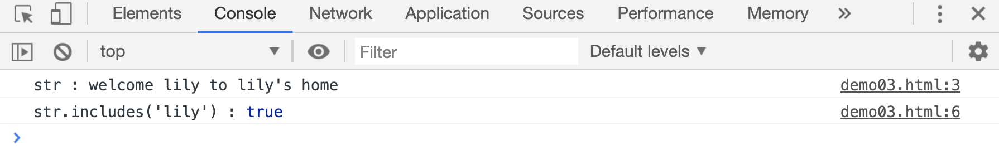
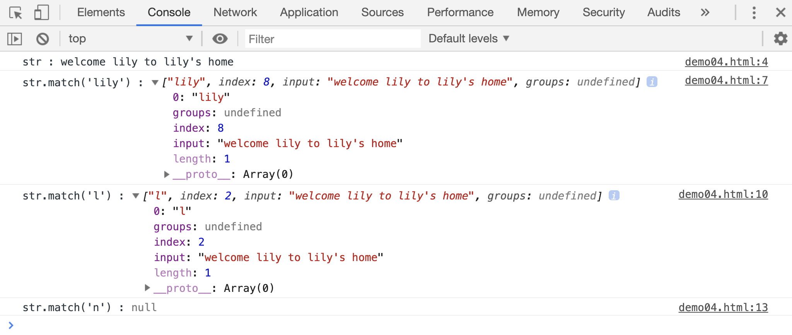

# 在字符串中查找字符

`String`对象提供了以下几种判断字符串中是否包含某些字符的方法：

## indexOf()

`str.indexOf(target)`，在字符串中从前往后查找第一个`target`字符,返回`target首字母`的索引值。没有则返回`-1`

> 注意`target`可以是一段字符串，返回的是这段字符串`首字母`在原字符串中的索引值

```html
<script>
    var str = "hello world";
    var res = str.indexOf("llo");
    console.log("str :", str);
    console.log("str.indexOf('llo') :", res);
</script>
```

[代码案例](./demo/demo01.html)



## lastIndexOf()

`str.lastIndexOf(target)`，与`indexOf()`相反，该方法从右往左查找第一次匹配的字符串，如果有，返回`target`首字母所在的索引值，没有则返回 `-1`

```html
<script>
    var str = "welcome lily to lily's home";
    console.log("str :", str);

    var res = str.indexOf("lily");
    console.log("str.indexOf('lily') :", res);

    res = str.lastIndexOf("lily");
    console.log("str.lastIndexOf('lily') :", res);
</script>
```

[代码案例](./demo/demo02.html)



## includes()

`str.includes(target)`，用来判断字符串中是否包含某段字符，返回布尔值。

如果包含 `target` 字符返回 `true`，否则返回 `false`。

```html
<script>
    var str = "welcome lily to lily's home";
    console.log("str :", str);

    var res = str.includes("lily");
    console.log("str.includes('lily') :", res);
</script>
```

[代码案例](./demo/demo03.html)



## match()

`string.match(pattern)`方法，也是用来判断字符串中是否包含指定字符的，但该方法会返回一个数组。该数组包含匹配的字符、第一次发现匹配字符的下标、原字符串内容等信息。如果没有匹配字符，该函数返回`null`

```html
<script>
    var str, res;
    str = "welcome lily to lily's home";
    console.log("str :", str);

    res = str.match("lily");
    console.log("str.match('lily') :", res);

    res = str.match("l");
    console.log("str.match('l') :", res);
</script>
```

[代码案例](./demo/demo04.html)


