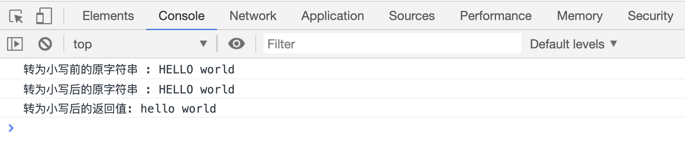
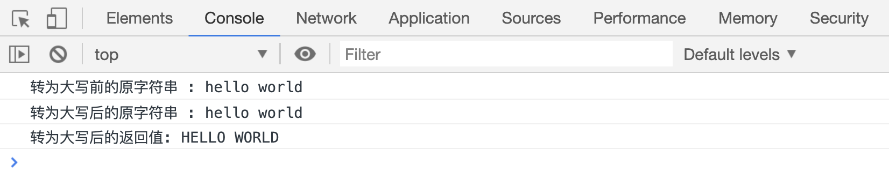

# 转换字符串大小写

JS 为字符串提供了两个方法，用来把小写字母转成大写字母，或者把大写字母转成小写字母。

## toLowerCase()

`str.toLowerCase()`用来把大写字母转换成小写字母，返回转换后的新字符串，不影响原字符串。

```html
<script>
    var str = "HELLO world";
    console.log("转为小写前的原字符串 :", str);

    var res = str.toLowerCase();
    console.log("转为小写后的原字符串 :", str);
    console.log("转为小写后的返回值:", res);
</script>
```

[代码案例](./demo/demo01.html)



## toUpperCase()

`str.toUpperCase()`用来把小写字母转换成大写字母，返回转换后的新字符串，不影响原字符串。

```html
<script>
    var str = "hello world";
    console.log("转为大写前的原字符串 :", str);

    var res = str.toUpperCase();
    console.log("转为大写后的原字符串 :", str);
    console.log("转为大写后的返回值:", res);
</script>
```

[代码案例](./demo/demo02.html)


