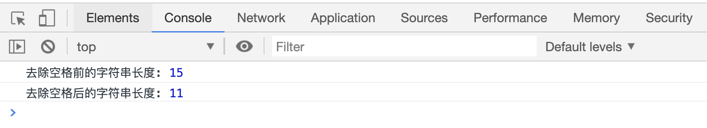

# 去除字符串前后的空格

`str.trim()`方法用来去除字符串前后的空格，返回去除空格后的字符串，不会影响原有字符串。

```html
<script>
    var str = "  HELLO world  ";
    console.log("去除空格前的字符串长度:", str.length);

    var res = str.trim();
    console.log("去除空格后的原字符串长度:", str.length);
    console.log("去除空格后的返回值长度:", res.length);
</script>
```

[代码案例](./demo/demo01.html)


