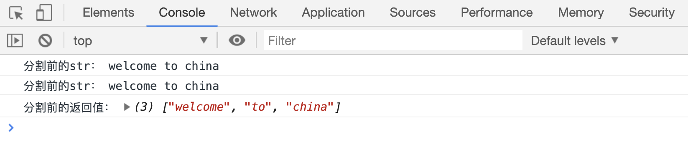
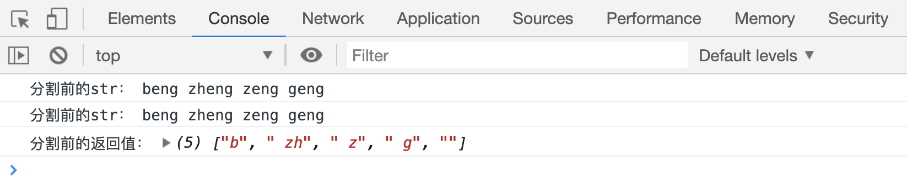

# 拼接和分割字符串

## concat()

除了前面讲的使用`+`拼接字符串，`str.concat(str1 [, str2, str3])`方法也可以用来拼接多个字符串，并返回拼接后新的字符串，不影响原字符串。

```html
<script>
    var str1 = "welcome ",
        str2 = "to ",
        str3 = "china。";

    var res = str1.concat(str2, str3);

    console.log("合并后的str1：", str1);
    console.log("合并后的str2：", str2);
    console.log("合并后的str3：", str3);
    console.log("合并后的返回值：", res);
</script>
```

[代码案例](./demo/demo01.html)


## split()

`str.split([separator [,length]])`方法用于把字符串分割为字符串数组。

```html
<script>
    var str = "welcome to china";
    console.log("分割前的str：", str);

    // 以空格字符为界限，分割字符串
    var res = str.split(" ");
    console.log("分割前的str：", str);
    console.log("分割前的返回值：", res);
</script>
```

[代码案例](./demo/demo02.html)



```html
<script>
    var str = "welcome to china";
    console.log("分割前的str：", str);

    // 以o字符为界限，分割字符串
    var res = str.split("o");
    console.log("分割前的str：", str);
    console.log("分割前的返回值：", res);
</script>
```

[代码案例](./demo/demo03.html)


```html
<script>
    var str = "beng zheng zeng geng";
    console.log("分割前的str：", str);

    // 以eng字符为界限，分割字符串
    var res = str.split("eng");
    console.log("分割前的str：", str);
    console.log("分割前的返回值：", res);
</script>
```

[代码案例](./demo/demo04.html)



第二个参数`length`用来指定返回的新数组中保留多少个元素

```html
<script>
    var str = "beng zheng zeng geng";
    console.log("分割前的str：", str);

    // 以eng字符为界限，分割字符串，返回的数组中只保留前2个元素
    var res = str.split("eng", 2);
    console.log("分割前的str：", str);
    console.log("分割前的返回值：", res);
</script>
```

[代码案例](./demo/demo05.html)


