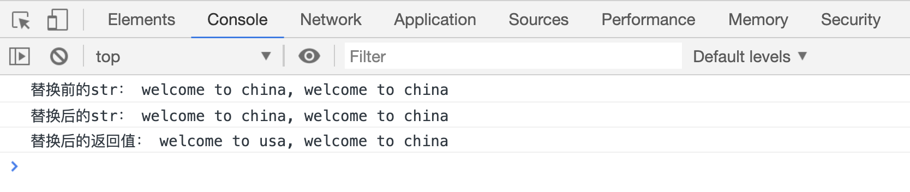
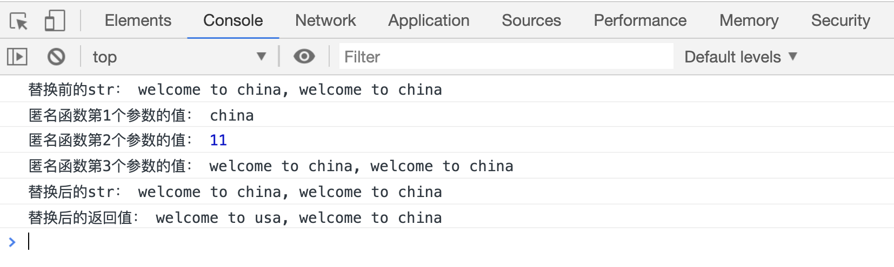
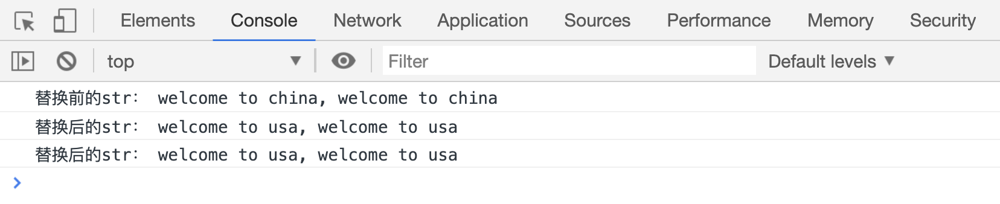

# 替换字符串

`str.replace()`方法在字符串中查找指定字符串，并替换为指定内容；返回替换后的新字符串。该方法有多种用法。

## replace(pattern, newStr)

-   `pattern` 表示将要被`newStr`替换的字符串内容
-   `newStr` 表示用来替换掉`pattern`部分的字符串内容

```html
<script>
    var str = "welcome to china, welcome to china";
    console.log("替换前的str：", str);

    var res = str.replace("china", "usa");
    console.log("替换后的str：", str);
    console.log("替换后的返回值：", res);
</script>
```

[代码案例](./demo/demo01.html)



> 当`pattern`为是字符串类型是，只会替换原字符串中从左到到右第一个与`pattern`相同的字符，比如上面案例中的第 2 个`china`，就没有被新字符串替换掉。

## str.replace(pattern, fn(match, index, oldStr))

-   `pattern`表示将要被替换的字符串内容
-   `match`表示在原字符串中被找到的和`pattern`匹配的第一个内容
-   `index`表示匹配字符串第一个字母的索引值
-   `oldStr`表示原有字符串

> 注意：这里函数接收的三个参数值，必须在`pattern`为字符串类型时才能使用

```html
<script>
    var str = "welcome to china, welcome to china";
    console.log("替换前的str：", str);

    var res = str.replace("china", function(match, index, oldStr) {
        console.log("匿名函数第1个参数的值：", match);
        console.log("匿名函数第2个参数的值：", index);
        console.log("匿名函数第3个参数的值：", oldStr);
        return "usa";
    });
    console.log("替换后的str：", str);
    console.log("替换后的返回值：", res);
</script>
```

[代码案例](./demo/demo02.html)



## 替换所有符合`pattern`的字符串

前面说只能替换符合`pattern`的第一批字符串，那么如何实现替换所有符合`pattern`的字符呢？

```html
<script>
    var str = "welcome to china, welcome to china";
    console.log("替换前的str：", str);

    // 每替换一次，就把替换后的新字符串，赋值给str
    while (str.includes("china")) {
        str = str.replace("china", "usa");
    }
    console.log("替换后的str：", str);
    console.log("替换后的str：", str);
</script>
```

[代码案例](./demo/demo03.html)



案例中，每替换一次，就把替换后的新字符串，赋值给`str`。当`str`中不再包含`china`时，`str.includes('china')`的返回值为`false`，while 循环的条件为 `false`，自然就停止循环了。

使用`do...while`也可以实现：

```html
<script>
    var str = "welcome to china, welcome to china";
    console.log("替换前的str：", str);

    do {
        str = str.replace("china", "usa");
    } while (str.includes("china"));

    console.log("替换后的str：", str);
    console.log("替换后的str：", str);
</script>
```

[代码案例](./demo/demo04.html)


## 使用正则表达式

> 正则表达式还没讲到，暂时先不讲使用正则表达式替换的方法
