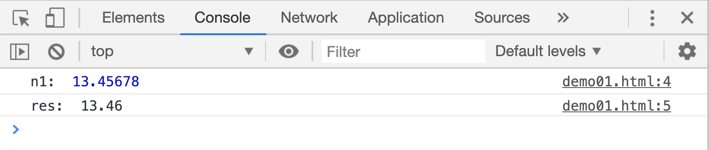
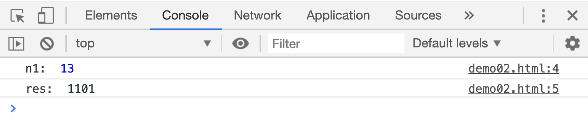
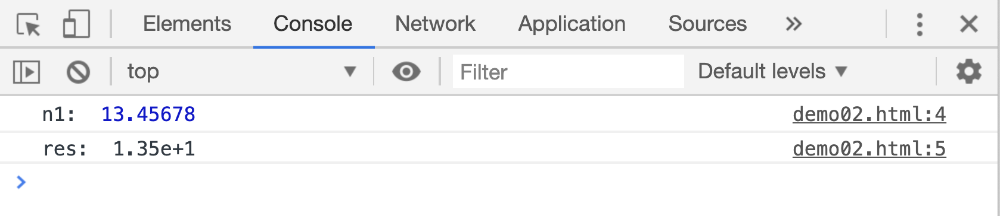
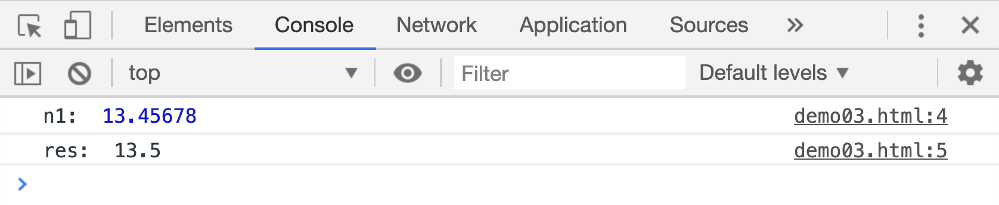

# Number 对象及其运用

Nmber 对象提供了一系列的方法，用来对数字进行不同的处理。

## toFixed

`num.toFixed(x)`方法，把 num 的值转为字符串，且可以指定小数点后保留的位数；该方法返回转换后的字符串

```html
<script>
    var n1 = 13.45678;
    var res = n1.toFixed(2);
    console.log("n1: ", n1);
    console.log("res: ", res);
</script>
```

[](./demo/demo01.html)



## toString()

`num.toString(x)`方法用来把数字转换成字符串，且可以指定字符串的表示方法。比如如果 x 的值为 2，返回的就是一个二进制的字符串

```html
<script>
    var n1 = 13;
    var res = n1.toString(2);
    console.log("n1: ", n1);
    console.log("res: ", res);
</script>
```

[](./demo/demo02.html)



## toExponential()

`num.toExponential()`方法用来把 num 转换成十进制计数法。

```html
<script>
    var n1 = 13.45678;
    var res = n1.toExponential(2);
    console.log("n1: ", n1);
    console.log("res: ", res);
</script>
```

[](./demo/demo03.html)



## toPrecision()

`num.toPrecision(x)`用来把数字转为字符串，且可以指定保留的字符个数，返回转换出的字符串

```html
<script>
    var n1 = 13.45678;
    var res = n1.toPrecision(3);
    console.log("n1: ", n1);
    console.log("res: ", res);
</script>
```

[](./demo/demo04.html)


